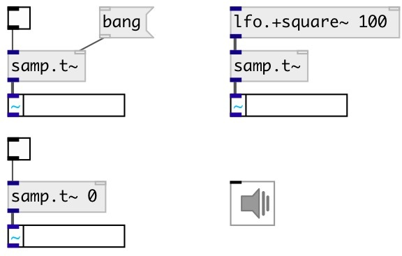

[index](index.html) :: [samp](category_samp.html)
---

# samp.time~

###### sample counter

*доступно с версии:* 0.9.4

---

## аргументы:

* **STATE**
initial counter state: on or off 
_тип:_ int 

## методы:

* **reset**
reset sample counter to 0 

* **set**
set current value 
  __параметры:__
  - **[VAL=0]** new counter value 
    тип: float  

## входы:

* on 0-&gt;1 change: start counter, on 1-&gt;0 stops. 
_тип:_ audio
* reset sample counter 
_тип:_ control

## выходы:

* current sample number 
_тип:_ control

## ключевые слова:

[base](keywords/base.html)

**Авторы:** Serge Poltavsky

**Лицензия:** GPL3 or later

