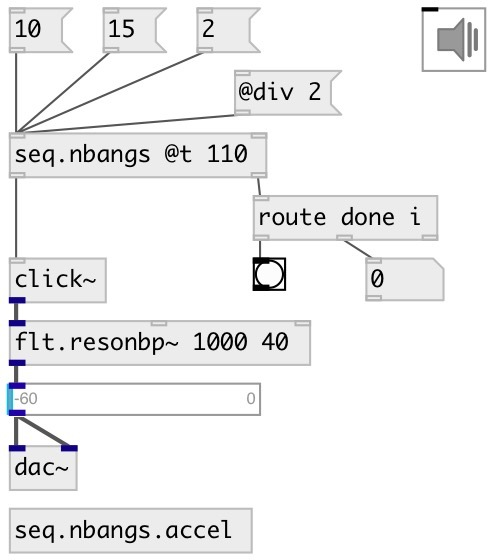

[index](index.html) :: [seq](category_seq.html)
---

# seq.nbangs

###### output specified number of bang with time intervals

*доступно с версии:* 0.9.1

---

## аргументы:

* **N**
number of bangs 
_тип:_ int 

* **T**
time interval between bangs 
_тип:_ float 
_единица:_ ms 

## методы:

* **start**
start/stop 
  __параметры:__
  - **[on=1]** if true - starts bang sequence, otherwise stops 
    тип: int  

* **stop**
stop bang output 

* **reset**
stop bang output and reset bang counter 

* **rewind**
reset all counters without stopping 

* **tick**
manually output current sequence element and move to next 

## свойства:

* **@dur** 
Запросить/установить sequence duration. Changing this property also changes @t interval between
bangs. 
_тип:_ float 
_минимальное значение:_ 0 
_по умолчанию:_ 0 

* **@n** 
Запросить/установить number of bangs 
_тип:_ int 
_минимальное значение:_ 0 
_по умолчанию:_ 0 

* **@t** 
Запросить/установить time interval between bangs. You could also use units values like 100ms or
120bpm. 
_тип:_ float 
_единица:_ ms 
_диапазон:_ 1..20000 
_по умолчанию:_ 0 

## входы:

* reset counter and starts output 
_тип:_ control
* set number of bangs 
_тип:_ control

## выходы:

* bang output 
_тип:_ control
* [i IDX N( - bang index or [done( when done 
_тип:_ control

## ключевые слова:

[seq](keywords/seq.html)
[bang](keywords/bang.html)
[until](keywords/until.html)

**Смотрите также:**
[\[seq.bangs\]](seq.bangs.html)
[\[seq.toggles\]](seq.toggles.html)

**Авторы:** Serge Poltavsky

**Лицензия:** GPL3 or later

