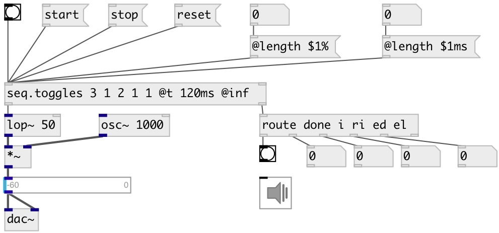

[index](index.html) :: [seq](category_seq.html)
---

# seq.toggles

###### toggle sequencer

*доступно с версии:* 0.9.1

---

## информация
Output 1 on event start and 0 on event stop The event length is controlled via @length property. It can be fixed, percent or subtractive. Percent values are calculated from whole event duration. Positive values &gt;=0 treated as fixed event length. Values &lt;0 are calculated as EVENT_DUR-value • &#39;percent&#39;: @length 60% and @t 100ms - for event value &#39;2&#39;, event duration is 200ms, event length is 120ms • &#39;fixed&#39;: @length 10 or @length 10ms and @t 100ms - event any duration, event length is fixed: 10ms • &#39;subtract&#39;: @length -40 and @t 100ms - for event value &#39;2&#39;, event duration is 200ms, event length is 160 (200-40). For event value &#39;1&#39;, event duration is 100ms, event length is 60 (100-40)

## аргументы:

* **P**
sequencer pattern in beat duration units 
_тип:_ list 

## методы:

* **reset**
reset all counters and stop 

* **rewind**
reset all counters without stopping 

* **start**
start sequencer from current position 

* **stop**
stop sequencer 

* **tick**
output current sequence element and move to next 

## свойства:

* **@div** 
Запросить/установить beat subdivision 
_тип:_ int 
_диапазон:_ 1..64 
_по умолчанию:_ 1 

* **@t** 
Запросить/установить time between beats. Unit values like 100ms, 240bpm or 60|4bpm also can be used 
_тип:_ float 
_единица:_ ms 
_диапазон:_ 1..20000 
_по умолчанию:_ 100 

* **@p** 
Запросить/установить sequencer pattern in beat duration units 
_тип:_ list 

* **@r** 
Запросить/установить number of whole sequence repeats. If -1: repeat infinitely 
_тип:_ int 
_минимальное значение:_ -1 
_по умолчанию:_ 1 

* **@inf** 
Запросить/установить alias to @r -1, repeats infinitely 
_тип:_ alias 

* **@once** 
Запросить/установить alias to @r 1, play once 
_тип:_ alias 

* **@dur** 
Запросить/установить whole sequence duration. (Recalculates @t property accordingly) 
_тип:_ float 
_единица:_ ms 
_минимальное значение:_ 0 
_по умолчанию:_ 0 

* **@upbeat** 
Запросить/установить wait specified number of beats before sequence start 
_тип:_ float 
_минимальное значение:_ 0 
_по умолчанию:_ 0 

* **@length** 
Запросить/установить event length. In case of float or float wuth &#39;ms&#39; suffix - event length is
fixed for any event duration. In case of V% - @length expected to be in 0..100
range and event length is percent of duration. In case of negative @length
event duration is calculated as duration+@length, but not less then 1 
_тип:_ float 
_по умолчанию:_ 75 

* **@i** (readonly)
Запросить current sequence iteration 
_тип:_ int 
_по умолчанию:_ 0 

* **@ri** (readonly)
Запросить current repeat iteration 
_тип:_ int 
_по умолчанию:_ 0 

* **@mode** 
Запросить/установить sequencer mode. &#39;inc&#39;: from first to last, &#39;dec&#39;: from last to first, &#39;tri&#39;:
from first to last, then back 
_тип:_ symbol 
_варианты:_ inc, dec, tri 
_по умолчанию:_ inc 

## входы:

* reset sequence and repeat counters and start sequencer 
_тип:_ control
* set new pattern value 
_тип:_ control

## выходы:

* 1 and 0 
_тип:_ control
* [i IDX N( - sequence iteration, [ri IDX N( - repeat iteration, [ed MS( - event duration, [el MS( event length or [done( when done 
_тип:_ control

## ключевые слова:

[seq](keywords/seq.html)
[sequencer](keywords/sequencer.html)
[toggle](keywords/toggle.html)
[pattern](keywords/pattern.html)
[rhythm](keywords/rhythm.html)

**Авторы:** Serge Poltavsky

**Лицензия:** GPL3 or later

