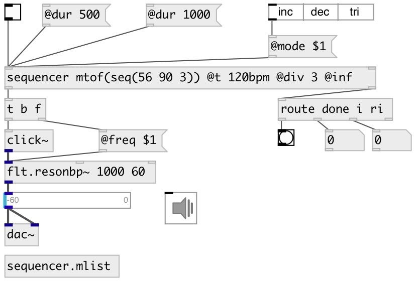

[index](index.html) :: [seq](category_seq.html)
---

# sequencer

###### basic sequence player

*доступно с версии:* 0.9.1

---

## аргументы:

* **VALUES**
sequence elements 
_тип:_ list 

## методы:

* **start**
start/stop 
  __параметры:__
  - **[on=1]** if true - starts sequencer, otherwise stops 
    тип: int  

* **stop**
stop output 

* **reset**
reset counters and stop 

* **rewind**
reset all counters without stopping 

* **tick**
manually output current element and move to next 

## свойства:

* **@v** 
Запросить/установить sequence elements 
_тип:_ list 

* **@dur** 
Запросить/установить whole sequence duration. Changing this property also changes @t interval
between bangs. 
_тип:_ float 
_минимальное значение:_ 0 
_по умолчанию:_ 0 

* **@t** 
Запросить/установить time interval between bangs. You could also use units values like 100ms or
120bpm. 
_тип:_ float 
_единица:_ ms 
_диапазон:_ 1..20000 
_по умолчанию:_ 20 

* **@r** 
Запросить/установить number of whole sequence repeats. If -1: output infinitly. 
_тип:_ int 
_минимальное значение:_ -1 
_по умолчанию:_ 1 

* **@once** 
Запросить/установить alias to @r 1 
_тип:_ alias 

* **@inf** 
Запросить/установить alias to @r -1 
_тип:_ alias 

* **@i** (readonly)
Запросить current sequence iteration 
_тип:_ int 
_минимальное значение:_ 0 
_по умолчанию:_ 0 

* **@ri** (readonly)
Запросить current repeat iteration 
_тип:_ int 
_минимальное значение:_ 0 
_по умолчанию:_ 0 

* **@mode** 
Запросить/установить sequencer mode. &#39;inc&#39;: from first to last, &#39;dec&#39;: from last to first, &#39;tri&#39;:
from first to last, then back 
_тип:_ symbol 
_варианты:_ inc, dec, tri 
_по умолчанию:_ inc 

## входы:

* reset all counters and start 
_тип:_ control
* set sequence 
_тип:_ control

## выходы:

* sequence element output, in case of Mlist args - outputs play lists 
_тип:_ control
* [i IDX N( - sequence iteration, [ri IDX N( - repeat iteration or [done( when done 
_тип:_ control

## ключевые слова:

[sequencer](keywords/sequencer.html)

**Авторы:** Serge Poltavsky

**Лицензия:** GPL3 or later

