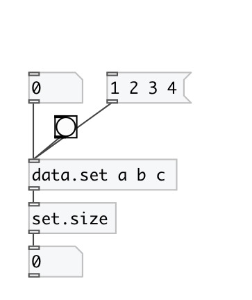

[index](index.html) :: [data](category_data.html)
---

# set.size

###### get number of elements in set

*доступно с версии:* 0.3

---

## входы:

* input set. Other values are ignored 
_тип:_ control

## выходы:

* number of element in set 
_тип:_ control

## ключевые слова:

[data](keywords/data.html)
[set](keywords/set.html)
[size](keywords/size.html)

**Смотрите также:**
[\[data.set\]](data.set.html)

**Авторы:** Serge Poltavsky

**Лицензия:** GPL3 or later

