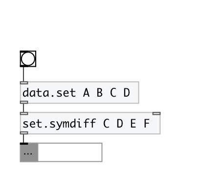

[index](index.html) :: [data](category_data.html)
---

# set.symdiff

###### symmetric difference between two sets

*доступно с версии:* 0.3

---

## информация
Symmetric difference, of two sets is the set of elements which are in either of the sets and not in their intersection

## аргументы:

* **ARGS**
right set elements 
_тип:_ any 

## входы:

* first set or list (converted to set), other values are ignored 
_тип:_ control
* second set or list (converted to set) 
_тип:_ control

## выходы:

* output symmetric set difference 
_тип:_ control

## ключевые слова:

[data](keywords/data.html)
[symmetric](keywords/symmetric.html)
[difference](keywords/difference.html)
[set](keywords/set.html)

**Смотрите также:**
[\[data.set\]](data.set.html)
[\[set.diff\]](set.diff.html)

**Авторы:** Serge Poltavsky

**Лицензия:** GPL3 or later

