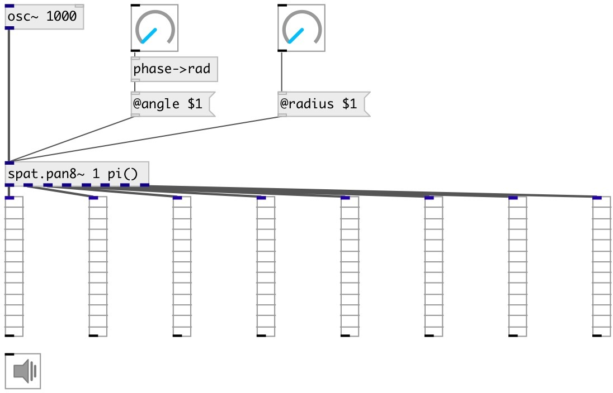

[index](index.html) :: [spat](category_spat.html)
---

# spat.pan8~

###### GMEM SPAT: 8-outputs spatializer

*доступно с версии:* 0.6

---

## аргументы:

* **RADIUS**
panning radius 
_тип:_ float 

* **ANGLE**
circle panning position in radians 
_тип:_ float 
_единица:_ rad 

## свойства:

* **@angle** 
Запросить/установить panning position in radians 
_тип:_ float 
_диапазон:_ 0..2π 
_по умолчанию:_ 0 

* **@radius** 
Запросить/установить distance from circle center 
_тип:_ float 
_диапазон:_ 0..1 
_по умолчанию:_ 1 

* **@active** 
Запросить/установить on/off dsp processing 
_тип:_ bool 
_по умолчанию:_ 1 

## входы:

* input signal 
_тип:_ audio

## выходы:

* 1st output channel 
_тип:_ audio
* 2nd output channel 
_тип:_ audio
* 3rd output channel 
_тип:_ audio
* 4th output channel 
_тип:_ audio
* 5th output channel 
_тип:_ audio
* 6th output channel 
_тип:_ audio
* 7th output channel 
_тип:_ audio
* 8th output channel 
_тип:_ audio

## ключевые слова:

[spat](keywords/spat.html)
[pan](keywords/pan.html)

**Смотрите также:**
[\[pan4~\]](pan4~.html)

**Авторы:** Serge Poltavsky

**Лицензия:** GPL3 or later

