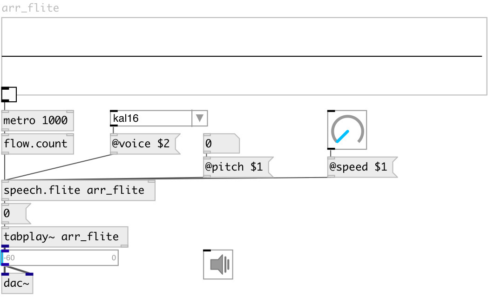

[index](index.html) :: [misc](category_misc.html)
---

# speech.flite

###### рендеринг синтезатора речи в массив

*доступно с версии:* 0.6

---

## информация
Renders floats, symbols and list to wavetables using flite TTS engine. Rendering is performed in separate thread.

## аргументы:

* **ARRAY**
destination array name render to 
_тип:_ symbol 

## свойства:

* **@array** 
Запросить/установить destination array name 
_тип:_ symbol 

* **@pitch** 
Запросить/установить voice pitch (-1 - default value) 
_тип:_ float 
_по умолчанию:_ -1 

* **@speed** 
Запросить/установить speaking speed 
_тип:_ float 
_диапазон:_ 1..4 
_по умолчанию:_ 1 

* **@voice** 
Запросить/установить default voice 
_тип:_ symbol 
_варианты:_ kal16, slt, rms, awb 
_по умолчанию:_ kal16 

## входы:

* render number to array 
_тип:_ control
* set target array name 
_тип:_ control

## выходы:

* bang on done 
_тип:_ control

## ключевые слова:

[speak](keywords/speak.html)
[speech](keywords/speech.html)
[flite](keywords/flite.html)

**Авторы:** Serge Poltavsky

**Лицензия:** GPL3 or later

