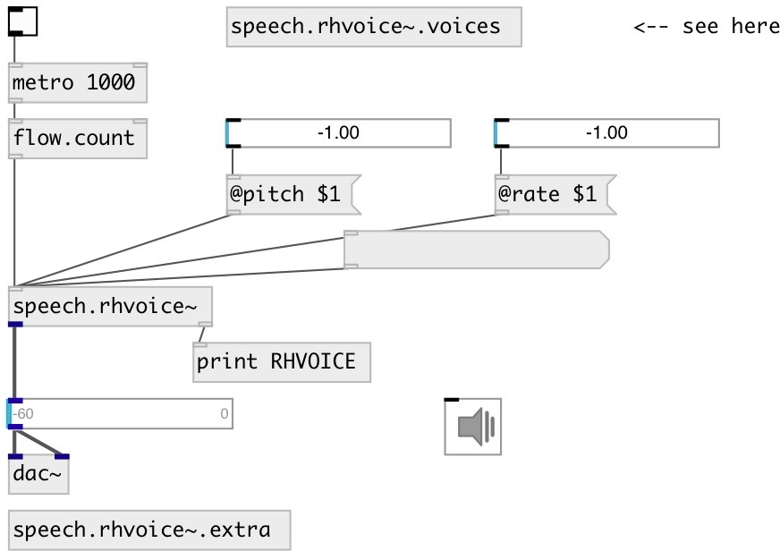

[index](index.html) :: [misc](category_misc.html)
---

# speech.rhvoice~

###### RHVoice text to speech synthesis

*доступно с версии:* 0.9.5

---

## информация
Note: no voices data in distributed with PureData-ceammc, you have to install voices manually Download language and voice datafiles and put them into ~/Documents/Pd/rhvoice directory

## методы:

* **stop**
stops speech and clear TTS queue 

* **clear**
clear TTS queue 

## свойства:

* **@voice** 
Запросить/установить voice 
_тип:_ symbol 
_по умолчанию:_ Anna 

* **@rate** 
Запросить/установить speaking rate 
_тип:_ float 
_диапазон:_ -1..1 
_по умолчанию:_ 0 

* **@pitch** 
Запросить/установить voice pitch 
_тип:_ float 
_диапазон:_ -1..1 
_по умолчанию:_ 0 

* **@volume** 
Запросить/установить voice volume 
_тип:_ float 
_диапазон:_ 0..1 
_по умолчанию:_ 1 

## входы:

* speak number 
_тип:_ control

## выходы:

* TTS output 
_тип:_ audio
* bang on done 
_тип:_ control

## ключевые слова:

[speak](keywords/speak.html)
[speech](keywords/speech.html)
[flite](keywords/flite.html)

**Смотрите также:**
[\[speech.flite~\]](speech.flite~.html)

**Авторы:** Serge Poltavsky

**Лицензия:** GPL3 or later

