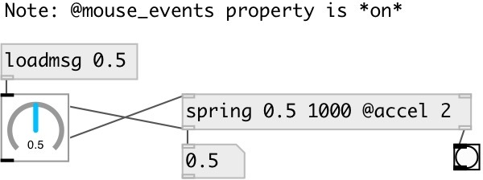

[index](index.html) :: [base](category_base.html)
---

# spring

###### float value &#34;spring&#34;

*доступно с версии:* 0.9.4

---

## аргументы:

* **VALUE**
target value 
_тип:_ float 

* **TIME**
time to reach the target value 
_тип:_ float 
_единица:_ ms 

## свойства:

* **@value** 
Запросить/установить target value 
_тип:_ float 
_по умолчанию:_ 0 

* **@time** 
Запросить/установить time to reach target value 
_тип:_ float 
_единица:_ ms 
_диапазон:_ 50..5000 
_по умолчанию:_ 500 

* **@accel** 
Запросить/установить acceleration factor, 0: means linear motion (no acceleration), &gt;0: begin fast,
then slow down, &lt;0: begin slow, then speed up 
_тип:_ float 
_диапазон:_ -5..5 
_по умолчанию:_ 0 

* **@mouse_down** 
Запросить/установить internal state 
_тип:_ bool 
_по умолчанию:_ 0 

* **@mouse_up** 
Запросить/установить internal state 
_тип:_ bool 
_по умолчанию:_ 0 

* **@mouse_move** 
Запросить/установить internal state 
_тип:_ bool 
_по умолчанию:_ 0 

* **@mouse_drag** 
Запросить/установить internal state 
_тип:_ bool 
_по умолчанию:_ 0 

## входы:

* set current value 
_тип:_ control
* set @value 
_тип:_ control

## выходы:

* float: value 
_тип:_ control
* bang: when target value is reached 
_тип:_ control

## ключевые слова:

[spring](keywords/spring.html)
[float](keywords/float.html)

**Авторы:** Serge Poltavsky

**Лицензия:** GPL3 or later

