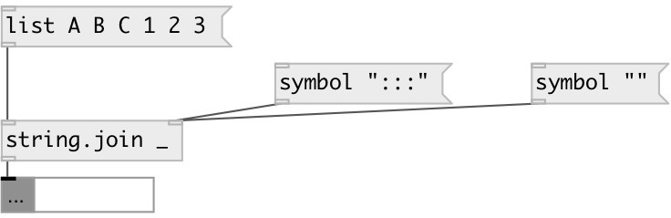

[index](index.html) :: [string](category_string.html)
---

# string.join

###### joins (concatenates) strings with separator

*доступно с версии:* 0.3

---

## аргументы:

* **SEP**
separator. For space use quotes. 
_тип:_ list 

## свойства:

* **@sep** 
Получить/установить separator 
_тип:_ symbol 

## входы:

* symbol passed untouched 
_тип:_ control
* change separator to new 
_тип:_ control

## выходы:

* result String 
_тип:_ control

## ключевые слова:

[join](keywords/join.html)

**Смотрите также:**
[\[string.split\]](string.split.html)

**Авторы:** Alex Nadzharov, Serge Poltavsky

**Лицензия:** GPL3 or later

