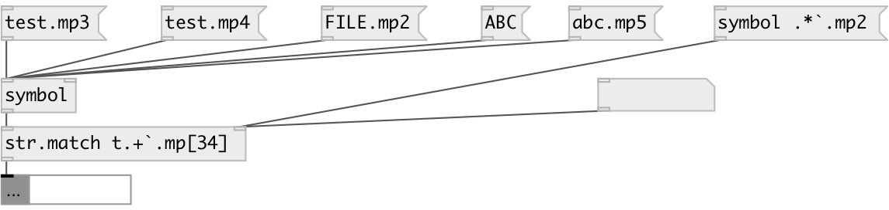

[index](index.html) :: [string](category_string.html)
---

# string.match

###### check if string match regular expression

*доступно с версии:* 0.7.1

---

## информация
Used syntax: re2 (like pcre). Some characters are non-supported in Pd. Use ` instead of backslash, `` instead of `, (( instead of {, )) instead of }, .. instead of comma, `: instead of semicolon If you need spaces: you should quote the string, also note that in quoted string ` symbol should be escaped like ``. For example, all digits: `d+, two or three chars: [a-z]((2..3)) etc.

## аргументы:

* **RE**
regular expression 
_тип:_ symbol 

## свойства:

* **@re** 
Получить/установить regular expression 
_тип:_ list 

## входы:

* input string or symbol 
_тип:_ control
* change regular expression 
_тип:_ control

## выходы:

* output 1 on successfull match, otherwise 0 
_тип:_ control

## ключевые слова:

[match](keywords/match.html)
[regex](keywords/regex.html)

**Авторы:** Serge Poltavsky

**Лицензия:** GPL3 or later

