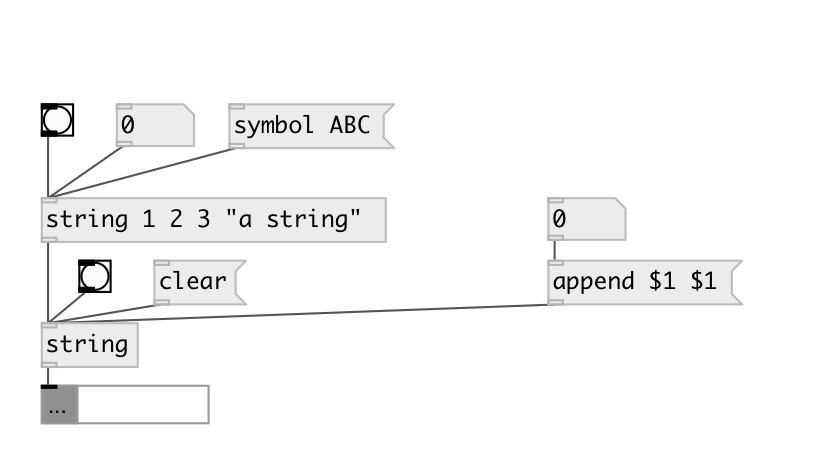

[index](index.html) :: [string](category_string.html)
---

# string

###### string constructor

*доступно с версии:* 0.3

---

## аргументы:

* **VALUE**
initial string 
_тип:_ symbol 

## методы:

* **append**
append values to the end of string 

* **clear**
clear string without output 

* **set**
set string content without output 

## свойства:

* **@value** 
Запросить/установить string value 
_тип:_ list 

## входы:

* outputs string value 
_тип:_ control

## выходы:

* string data 
_тип:_ control

## ключевые слова:

[string](keywords/string.html)
[data](keywords/data.html)

**Авторы:** Serge Poltavsky

**Лицензия:** GPL3 or later

