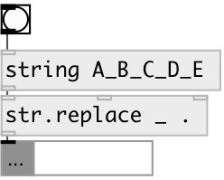

[index](index.html) :: [string](category_string.html)
---

# string.replace

###### replace from one substring to another in input string

*доступно с версии:* 0.3

---

## аргументы:

* **FROM**
substring for replace 
_тип:_ symbol 

* **TO**
substring to replace 
_тип:_ symbol 

## свойства:

* **@from** 
Получить/установить replace from 
_тип:_ symbol 

* **@to** 
Получить/установить replace to 
_тип:_ symbol 

* **@mode** 
Получить/установить replace mode 
_тип:_ symbol 
_варианты:_ all, first, last 
_по умолчанию:_ all 

* **@all** 
Получить/установить alias to @mode all - replace all occurences in input string 
_тип:_ alias 

* **@first** 
Получить/установить alias to @mode first - replace first occurence in input string 
_тип:_ alias 

* **@last** 
Получить/установить alias to @mode last - replace last occurence in input string 
_тип:_ alias 

## входы:

* input string or symbol 
_тип:_ control
* from 
_тип:_ control
* to 
_тип:_ control

## выходы:

* output string 
_тип:_ control

## ключевые слова:

[replace](keywords/replace.html)

**Смотрите также:**
[\[str.remove\]](str.remove.html)

**Авторы:** Serge Poltavsky

**Лицензия:** GPL3 or later

