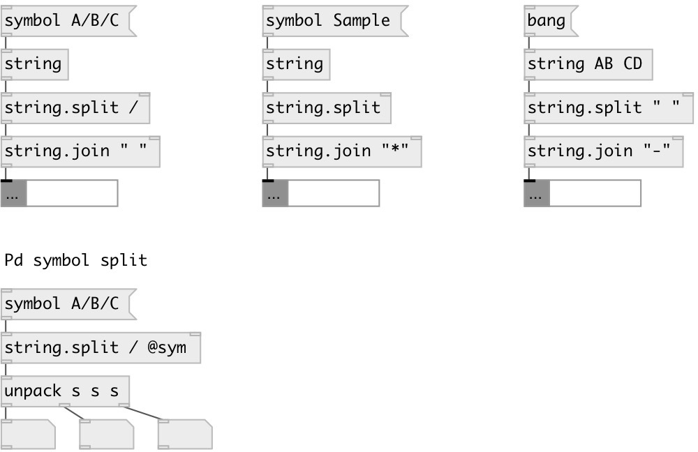

[index](index.html) :: [string](category_string.html)
---

# string.split

###### split string by separator

*доступно с версии:* 0.3

---

## информация
Note: by default string or symbol splitted to list of data:String, to get list of Pd symbols use @sym flag

## аргументы:

* **SEP**
separator. If nonspecified - separate by every char. To separate by space - use
&#34; &#34; argument 
_тип:_ atom 

## свойства:

* **@sep** 
Получить/установить separator 
_тип:_ symbol 

* **@sym** 
Получить/установить flag to output as list of Pd symbols 
_тип:_ flag 

## входы:

* input symbol 
_тип:_ control

## выходы:

* list of data:Strings or symbols 
_тип:_ control

## ключевые слова:

[split](keywords/split.html)

**Смотрите также:**
[\[string.join\]](string.join.html)

**Авторы:** Alex Nadzharov, Serge Poltavsky

**Лицензия:** GPL3 or later

