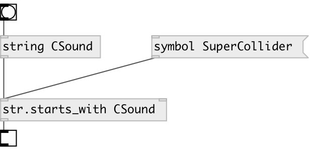

[index](index.html) :: [string](category_string.html)
---

# string.starts_with

###### checks if string starts with specified substring

*доступно с версии:* 0.3

---

## аргументы:

* **PREFIX**
prefix 
_тип:_ symbol 

## свойства:

* **@prefix** 
Запросить/установить prefix 
_тип:_ symbol 

## входы:

* input string or symbol 
_тип:_ control
* search prefix (string or symbol) 
_тип:_ control

## выходы:

* output 1 if input string starts with prefix, otherwise 0 
_тип:_ control

## ключевые слова:

[starts](keywords/starts.html)
[search](keywords/search.html)

**Смотрите также:**
[\[str.ends_with\]](str.ends_with.html)

**Авторы:** Serge Poltavsky

**Лицензия:** GPL3 or later

