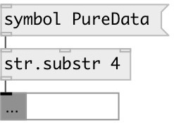

[index](index.html) :: [string](category_string.html)
---

# string.substr

###### extract substring from input string

*доступно с версии:* 0.3

---

## аргументы:

* **FROM**
substring position. May be relative: -1 means one character from the end of
stirng 
_тип:_ int 

* **LEN**
substring length. If -1 given (by default), means &#39;till string end&#39;. 
_тип:_ int 

## свойства:

* **@from** 
Запросить/установить substring position. Can be negative - to address string from the end 
_тип:_ int 
_по умолчанию:_ 0 

* **@len** 
Запросить/установить substring length. If equal to -1, substring to the end of string 
_тип:_ int 
_минимальное значение:_ 0 
_по умолчанию:_ -1 

## входы:

* input string 
_тип:_ control
* from 
_тип:_ control
* to 
_тип:_ control

## выходы:

* output substring 
_тип:_ control

## ключевые слова:

[substring](keywords/substring.html)

**Смотрите также:**
[\[string.split\]](string.split.html)

**Авторы:** Alex Nadzharov, Serge Poltavsky

**Лицензия:** GPL3 or later

