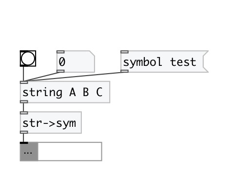

[index](index.html) :: [string](category_string.html)
---

# string2symbol

###### converts string to symbol

*доступно с версии:* 0.3

---

## входы:

* input string value 
_тип:_ control

## выходы:

* symbol output 
_тип:_ control

## ключевые слова:

[string](keywords/string.html)
[symbol](keywords/symbol.html)
[convert](keywords/convert.html)

**Авторы:** Serge Poltavsky

**Лицензия:** GPL3 or later

