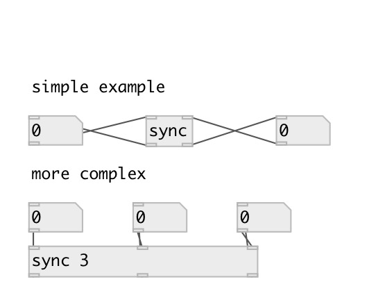

[index](index.html) :: [base](category_base.html)
---

# sync

###### value synchronization

*доступно с версии:* 0.9.1

---

## информация
The value send to inlet repeated to all outlets except from the current one. This prevents infinite loops

## аргументы:

* **N**
number of synchronized values 
_тип:_ int 

## свойства:

* **@n** (initonly)
Запросить/установить number of synced values 
_тип:_ int 
_диапазон:_ 2..8 
_по умолчанию:_ 2 

## входы:

* first synchronized input 
_тип:_ control
* ... synchronized input 
_тип:_ control
* n-th synchronized input 
_тип:_ control

## выходы:

* first synchronized output 
_тип:_ control
* ... synchronized output 
_тип:_ control
* n-th synchronized output 
_тип:_ control

## ключевые слова:

[sync](keywords/sync.html)

**Авторы:** Serge Poltavsky

**Лицензия:** GPL3 or later

