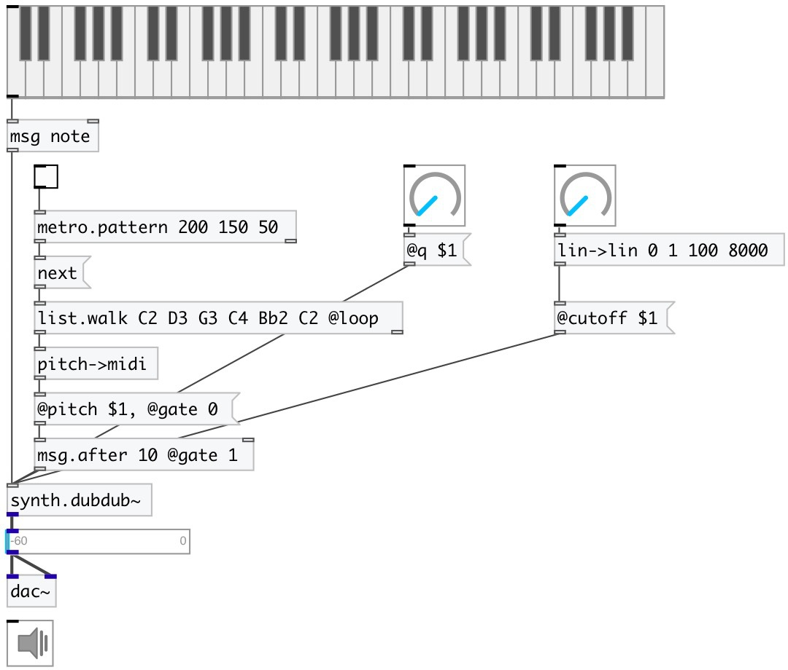

[index](index.html) :: [synth](category_synth.html)
---

# synth.dubdub~

###### simple synth based on a sawtooth wave filtered by a resonant lowpass

*доступно с версии:* 0.6

---

## методы:

* **note**
note on/off message 
  __параметры:__
  - **NOTE** midi note 
    тип: float  
    обязательно: True  

  - **VEL** velocity 
    тип: float  
    обязательно: True  

## свойства:

* **@pitch** 
Получить/установить midi pitch 
_тип:_ float 
_диапазон:_ 24..84 
_по умолчанию:_ 48 

* **@freq** 
Получить/установить frequency 
_тип:_ float 
_единица:_ Hz 
_по умолчанию:_ 130.813 

* **@cutoff** 
Получить/установить cutoff frequency 
_тип:_ float 
_диапазон:_ 20..20000 
_по умолчанию:_ 3000 

* **@gate** 
Получить/установить play trigger &gt;0: on, 0: off. Values greater then zero set output amplitude. 
_тип:_ float 
_диапазон:_ 0..1 
_по умолчанию:_ 0 

* **@q** 
Получить/установить quality factor 
_тип:_ float 
_диапазон:_ 0.01..100 
_по умолчанию:_ 0.1 

* **@active** 
Получить/установить on/off dsp processing 
_тип:_ int 
_варианты:_ 0, 1 
_по умолчанию:_ 1 

## входы:

* NOTE VEL 
_тип:_ control

## выходы:

* None 
_тип:_ audio

## ключевые слова:

[dubdub](keywords/dubdub.html)
[saw](keywords/saw.html)

**Авторы:** Serge Poltavsky

**Лицензия:** GPL3 or later

