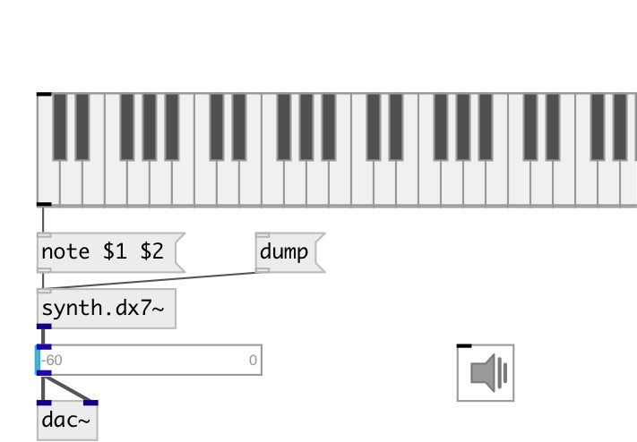

[index](index.html) :: [synth](category_synth.html)
---

# synth.dx7~

###### реализация синтезатора DX7 из библиотеки Faust

*доступно с версии:* 0.6

---

## методы:

* **load**
load the preset from a previously loaded sysex file 
  __параметры:__
  - **[IDX]** preset index 
    тип: int  

* **note**
note on/off message 
  __параметры:__
  - **NOTE** midi note 
    тип: float  
    обязательно: True  

  - **VEL** velocity 
    тип: float  
    обязательно: True  

* **read**
reads the DX7 sysex preset file 
  __параметры:__
  - **[PATH]** relative or absolute path to the DX sysex preset file 
    тип: symbol  

## свойства:

* **@osc** (initonly)
Запросить/установить OSC server name to listen 
_тип:_ symbol 

* **@id** (initonly)
Запросить/установить OSC address id. If specified, bind all properties to /ID/synth_dx7/PROP_NAME
osc address, if empty bind to /synth_dx7/PROP_NAME. 
_тип:_ symbol 

* **@active** 
Запросить/установить @active 
_тип:_ bool 
_по умолчанию:_ 1 

* **@algorithm** 
Запросить/установить FM algorithm number (0-based) 
_тип:_ int 
_диапазон:_ 0..31 
_по умолчанию:_ 0 

* **@feedback** 
Запросить/установить @feedback 
_тип:_ float 
_диапазон:_ 0.0..99.0 
_по умолчанию:_ 0.0 

* **@freq** 
Запросить/установить synth frequency 
_тип:_ float 
_единица:_ Hz 
_по умолчанию:_ 130.8127899169922 

* **@gain** 
Запросить/установить output gain 
_тип:_ float 
_диапазон:_ 0.0..1.0 
_по умолчанию:_ 0.800000011920929 

* **@gate** 
Запросить/установить note on/off signal 
_тип:_ float 
_диапазон:_ 0.0..1.0 
_по умолчанию:_ 0.0 

* **@op0:L1** 
Запросить/установить op0: Envelope Generator Level 1 
_тип:_ float 
_диапазон:_ 0.0..99.0 
_по умолчанию:_ 0.0 

* **@op0:L2** 
Запросить/установить op0: Envelope Generator Level 2 
_тип:_ float 
_диапазон:_ 0.0..99.0 
_по умолчанию:_ 90.0 

* **@op0:L3** 
Запросить/установить op0: Envelope Generator Level 3 
_тип:_ float 
_диапазон:_ 0.0..99.0 
_по умолчанию:_ 90.0 

* **@op0:L4** 
Запросить/установить op0: Envelope Generator Level 4 
_тип:_ float 
_диапазон:_ 0.0..99.0 
_по умолчанию:_ 0.0 

* **@op0:R1** 
Запросить/установить op0: Envelope Generator Rate 1 
_тип:_ float 
_диапазон:_ 0.0..99.0 
_по умолчанию:_ 90.0 

* **@op0:R2** 
Запросить/установить op0: Envelope Generator Rate 2 
_тип:_ float 
_диапазон:_ 0.0..99.0 
_по умолчанию:_ 90.0 

* **@op0:R3** 
Запросить/установить op0: Envelope Generator Rate 3 
_тип:_ float 
_диапазон:_ 0.0..99.0 
_по умолчанию:_ 90.0 

* **@op0:R4** 
Запросить/установить op0: Envelope Generator Rate 4 
_тип:_ float 
_диапазон:_ 0.0..99.0 
_по умолчанию:_ 90.0 

* **@op0:detune** 
Запросить/установить op0: detune 
_тип:_ float 
_диапазон:_ -10.0..10.0 
_по умолчанию:_ 1.0 

* **@op0:freq** 
Запросить/установить op0: frequency 
_тип:_ float 
_единица:_ Hz 
_диапазон:_ 0.0..32.0 
_по умолчанию:_ 1.0 

* **@op0:level** 
Запросить/установить op0: output level 
_тип:_ float 
_диапазон:_ 0.0..99.0 
_по умолчанию:_ 95.0 

* **@op0:opMode** 
Запросить/установить op0: opMode 
_тип:_ float 
_диапазон:_ 0.0..1.0 
_по умолчанию:_ 0.0 

* **@op0:rate** 
Запросить/установить op0: rate 
_тип:_ float 
_диапазон:_ 0.0..10.0 
_по умолчанию:_ 0.0 

* **@op0:vel** 
Запросить/установить op0: keyboard velocity sensivity 
_тип:_ float 
_диапазон:_ 0.0..8.0 
_по умолчанию:_ 1.0 

* **@op1:L1** 
Запросить/установить op1: Envelope Generator Level 1 
_тип:_ float 
_диапазон:_ 0.0..99.0 
_по умолчанию:_ 0.0 

* **@op1:L2** 
Запросить/установить op1: Envelope Generator Level 2 
_тип:_ float 
_диапазон:_ 0.0..99.0 
_по умолчанию:_ 90.0 

* **@op1:L3** 
Запросить/установить op1: Envelope Generator Level 3 
_тип:_ float 
_диапазон:_ 0.0..99.0 
_по умолчанию:_ 90.0 

* **@op1:L4** 
Запросить/установить op1: Envelope Generator Level 4 
_тип:_ float 
_диапазон:_ 0.0..99.0 
_по умолчанию:_ 0.0 

* **@op1:R1** 
Запросить/установить op1: Envelope Generator Rate 1 
_тип:_ float 
_диапазон:_ 0.0..99.0 
_по умолчанию:_ 90.0 

* **@op1:R2** 
Запросить/установить op1: Envelope Generator Rate 2 
_тип:_ float 
_диапазон:_ 0.0..99.0 
_по умолчанию:_ 90.0 

* **@op1:R3** 
Запросить/установить op1: Envelope Generator Rate 3 
_тип:_ float 
_диапазон:_ 0.0..99.0 
_по умолчанию:_ 90.0 

* **@op1:R4** 
Запросить/установить op1: Envelope Generator Rate 4 
_тип:_ float 
_диапазон:_ 0.0..99.0 
_по умолчанию:_ 90.0 

* **@op1:detune** 
Запросить/установить op1: detune 
_тип:_ float 
_диапазон:_ -10.0..10.0 
_по умолчанию:_ 1.0 

* **@op1:freq** 
Запросить/установить op1: frequency 
_тип:_ float 
_единица:_ Hz 
_диапазон:_ 0.0..32.0 
_по умолчанию:_ 1.0 

* **@op1:level** 
Запросить/установить op1: output level 
_тип:_ float 
_диапазон:_ 0.0..99.0 
_по умолчанию:_ 95.0 

* **@op1:opMode** 
Запросить/установить op1: FreqRatio or FreqFixed mode 
_тип:_ float 
_диапазон:_ 0.0..1.0 
_по умолчанию:_ 0.0 

* **@op1:rate** 
Запросить/установить op1:rate 
_тип:_ float 
_диапазон:_ 0.0..10.0 
_по умолчанию:_ 0.0 

* **@op1:vel** 
Запросить/установить op1: keyboard velocity sensivity 
_тип:_ float 
_диапазон:_ 0.0..8.0 
_по умолчанию:_ 1.0 

* **@op2:L1** 
Запросить/установить op2: Envelope Generator Level 1 
_тип:_ float 
_диапазон:_ 0.0..99.0 
_по умолчанию:_ 0.0 

* **@op2:L2** 
Запросить/установить op2: Envelope Generator Level 2 
_тип:_ float 
_диапазон:_ 0.0..99.0 
_по умолчанию:_ 90.0 

* **@op2:L3** 
Запросить/установить op2: Envelope Generator Level 3 
_тип:_ float 
_диапазон:_ 0.0..99.0 
_по умолчанию:_ 90.0 

* **@op2:L4** 
Запросить/установить op2: Envelope Generator Level 4 
_тип:_ float 
_диапазон:_ 0.0..99.0 
_по умолчанию:_ 0.0 

* **@op2:R1** 
Запросить/установить op2: Envelope Generator Rate 1 
_тип:_ float 
_диапазон:_ 0.0..99.0 
_по умолчанию:_ 90.0 

* **@op2:R2** 
Запросить/установить op2: Envelope Generator Rate 2 
_тип:_ float 
_диапазон:_ 0.0..99.0 
_по умолчанию:_ 90.0 

* **@op2:R3** 
Запросить/установить op2: Envelope Generator Rate 3 
_тип:_ float 
_диапазон:_ 0.0..99.0 
_по умолчанию:_ 90.0 

* **@op2:R4** 
Запросить/установить op2: Envelope Generator Rate 4 
_тип:_ float 
_диапазон:_ 0.0..99.0 
_по умолчанию:_ 90.0 

* **@op2:detune** 
Запросить/установить op2: detune 
_тип:_ float 
_диапазон:_ -10.0..10.0 
_по умолчанию:_ 1.0 

* **@op2:freq** 
Запросить/установить op2: frequency 
_тип:_ float 
_единица:_ Hz 
_диапазон:_ 0.0..32.0 
_по умолчанию:_ 1.0 

* **@op2:level** 
Запросить/установить op2: output level 
_тип:_ float 
_диапазон:_ 0.0..99.0 
_по умолчанию:_ 95.0 

* **@op2:opMode** 
Запросить/установить op2: FreqRatio or FreqFixed mode 
_тип:_ float 
_диапазон:_ 0.0..1.0 
_по умолчанию:_ 0.0 

* **@op2:rate** 
Запросить/установить op2: rate 
_тип:_ float 
_диапазон:_ 0.0..10.0 
_по умолчанию:_ 0.0 

* **@op2:vel** 
Запросить/установить op2: keyboard velocity sensivity 
_тип:_ float 
_диапазон:_ 0.0..8.0 
_по умолчанию:_ 1.0 

* **@op3:L1** 
Запросить/установить op3: Envelope Generator Level 1 
_тип:_ float 
_диапазон:_ 0.0..99.0 
_по умолчанию:_ 0.0 

* **@op3:L2** 
Запросить/установить op3: Envelope Generator Level 2 
_тип:_ float 
_диапазон:_ 0.0..99.0 
_по умолчанию:_ 90.0 

* **@op3:L3** 
Запросить/установить op3: Envelope Generator Level 3 
_тип:_ float 
_диапазон:_ 0.0..99.0 
_по умолчанию:_ 90.0 

* **@op3:L4** 
Запросить/установить op3: Envelope Generator Level 4 
_тип:_ float 
_диапазон:_ 0.0..99.0 
_по умолчанию:_ 0.0 

* **@op3:R1** 
Запросить/установить op3: Envelope Generator Rate 1 
_тип:_ float 
_диапазон:_ 0.0..99.0 
_по умолчанию:_ 90.0 

* **@op3:R2** 
Запросить/установить op3: Envelope Generator Rate 2 
_тип:_ float 
_диапазон:_ 0.0..99.0 
_по умолчанию:_ 90.0 

* **@op3:R3** 
Запросить/установить op3: Envelope Generator Rate 3 
_тип:_ float 
_диапазон:_ 0.0..99.0 
_по умолчанию:_ 90.0 

* **@op3:R4** 
Запросить/установить op3: Envelope Generator Rate 4 
_тип:_ float 
_диапазон:_ 0.0..99.0 
_по умолчанию:_ 90.0 

* **@op3:detune** 
Запросить/установить op3: detune 
_тип:_ float 
_диапазон:_ -10.0..10.0 
_по умолчанию:_ 1.0 

* **@op3:freq** 
Запросить/установить op3: frequency 
_тип:_ float 
_единица:_ Hz 
_диапазон:_ 0.0..32.0 
_по умолчанию:_ 1.0 

* **@op3:level** 
Запросить/установить op3: output level 
_тип:_ float 
_диапазон:_ 0.0..99.0 
_по умолчанию:_ 95.0 

* **@op3:opMode** 
Запросить/установить op3: FreqRatio or FreqFixed mode 
_тип:_ float 
_диапазон:_ 0.0..1.0 
_по умолчанию:_ 0.0 

* **@op3:rate** 
Запросить/установить op3: rate 
_тип:_ float 
_диапазон:_ 0.0..10.0 
_по умолчанию:_ 0.0 

* **@op3:vel** 
Запросить/установить op3: keyboard velocity sensivity 
_тип:_ float 
_диапазон:_ 0.0..8.0 
_по умолчанию:_ 1.0 

* **@op4:L1** 
Запросить/установить op4: Envelope Generator Level 1 
_тип:_ float 
_диапазон:_ 0.0..99.0 
_по умолчанию:_ 0.0 

* **@op4:L2** 
Запросить/установить op4: Envelope Generator Level 2 
_тип:_ float 
_диапазон:_ 0.0..99.0 
_по умолчанию:_ 90.0 

* **@op4:L3** 
Запросить/установить op4: Envelope Generator Level 3 
_тип:_ float 
_диапазон:_ 0.0..99.0 
_по умолчанию:_ 90.0 

* **@op4:L4** 
Запросить/установить op4: Envelope Generator Level 4 
_тип:_ float 
_диапазон:_ 0.0..99.0 
_по умолчанию:_ 0.0 

* **@op4:R1** 
Запросить/установить op4: Envelope Generator Rate 1 
_тип:_ float 
_диапазон:_ 0.0..99.0 
_по умолчанию:_ 90.0 

* **@op4:R2** 
Запросить/установить op4: Envelope Generator Rate 2 
_тип:_ float 
_диапазон:_ 0.0..99.0 
_по умолчанию:_ 90.0 

* **@op4:R3** 
Запросить/установить op4: Envelope Generator Rate 3 
_тип:_ float 
_диапазон:_ 0.0..99.0 
_по умолчанию:_ 90.0 

* **@op4:R4** 
Запросить/установить op4: Envelope Generator Rate 4 
_тип:_ float 
_диапазон:_ 0.0..99.0 
_по умолчанию:_ 90.0 

* **@op4:detune** 
Запросить/установить op4: detune 
_тип:_ float 
_диапазон:_ -10.0..10.0 
_по умолчанию:_ 1.0 

* **@op4:freq** 
Запросить/установить op4: frequency 
_тип:_ float 
_единица:_ Hz 
_диапазон:_ 0.0..32.0 
_по умолчанию:_ 1.0 

* **@op4:level** 
Запросить/установить op4: output level 
_тип:_ float 
_диапазон:_ 0.0..99.0 
_по умолчанию:_ 95.0 

* **@op4:opMode** 
Запросить/установить op4: FreqRatio or FreqFixed mode 
_тип:_ float 
_диапазон:_ 0.0..1.0 
_по умолчанию:_ 0.0 

* **@op4:rate** 
Запросить/установить op4: rate 
_тип:_ float 
_диапазон:_ 0.0..10.0 
_по умолчанию:_ 0.0 

* **@op4:vel** 
Запросить/установить op4: keyboard velocity sensivity 
_тип:_ float 
_диапазон:_ 0.0..8.0 
_по умолчанию:_ 1.0 

* **@op5:L1** 
Запросить/установить op5: Envelope Generator Level 1 
_тип:_ float 
_диапазон:_ 0.0..99.0 
_по умолчанию:_ 0.0 

* **@op5:L2** 
Запросить/установить op5: Envelope Generator Level 2 
_тип:_ float 
_диапазон:_ 0.0..99.0 
_по умолчанию:_ 90.0 

* **@op5:L3** 
Запросить/установить op5: Envelope Generator Level 3 
_тип:_ float 
_диапазон:_ 0.0..99.0 
_по умолчанию:_ 90.0 

* **@op5:L4** 
Запросить/установить op5: Envelope Generator Level 4 
_тип:_ float 
_диапазон:_ 0.0..99.0 
_по умолчанию:_ 0.0 

* **@op5:R1** 
Запросить/установить op5: Envelope Generator Rate 1 
_тип:_ float 
_диапазон:_ 0.0..99.0 
_по умолчанию:_ 90.0 

* **@op5:R2** 
Запросить/установить op5: Envelope Generator Rate 2 
_тип:_ float 
_диапазон:_ 0.0..99.0 
_по умолчанию:_ 90.0 

* **@op5:R3** 
Запросить/установить op5: Envelope Generator Rate 3 
_тип:_ float 
_диапазон:_ 0.0..99.0 
_по умолчанию:_ 90.0 

* **@op5:R4** 
Запросить/установить op5: Envelope Generator Rate 4 
_тип:_ float 
_диапазон:_ 0.0..99.0 
_по умолчанию:_ 90.0 

* **@op5:detune** 
Запросить/установить op5: detune 
_тип:_ float 
_диапазон:_ -10.0..10.0 
_по умолчанию:_ 1.0 

* **@op5:freq** 
Запросить/установить op5: frequency 
_тип:_ float 
_единица:_ Hz 
_диапазон:_ 0.0..32.0 
_по умолчанию:_ 1.0 

* **@op5:level** 
Запросить/установить op5: outut level 
_тип:_ float 
_диапазон:_ 0.0..99.0 
_по умолчанию:_ 95.0 

* **@op5:opMode** 
Запросить/установить op5: FreqRatio or FreqFixed mode 
_тип:_ float 
_диапазон:_ 0.0..1.0 
_по умолчанию:_ 0.0 

* **@op5:rate** 
Запросить/установить op5: rate 
_тип:_ float 
_диапазон:_ 0.0..10.0 
_по умолчанию:_ 0.0 

* **@op5:vel** 
Запросить/установить op5: keyboard velocity sensivity 
_тип:_ float 
_диапазон:_ 0.0..8.0 
_по умолчанию:_ 1.0 

* **@pitch** 
Запросить/установить midi pitch 
_тип:_ float 
_диапазон:_ 24..84 
_по умолчанию:_ 48 

## входы:

* NOTE VEL 
_тип:_ control

## выходы:

* synth output 
_тип:_ audio

## ключевые слова:

[dx7](keywords/dx7.html)
[synth](keywords/synth.html)
[fm](keywords/fm.html)

**Авторы:** Serge Poltavsky

**Лицензия:** GPL3 or later

