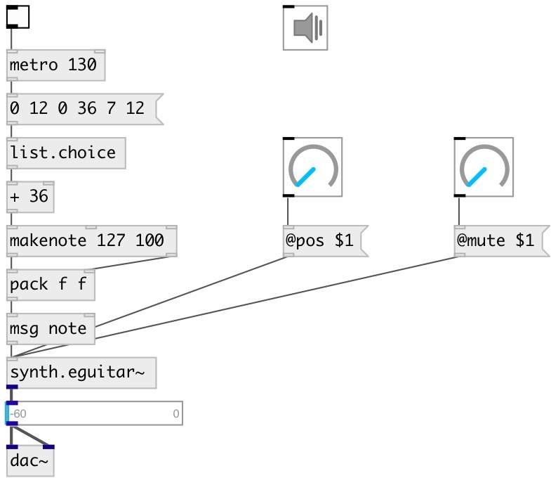

[index](index.html) :: [synth](category_synth.html)
---

# synth.eguitar~

###### simple electric guitar model with steel strings

*доступно с версии:* 0.6

---

## методы:

* **note**
note on/off message 
  __параметры:__
  - **NOTE** midi note 
    тип: float  
    обязательно: True  

  - **VEL** velocity 
    тип: float  
    обязательно: True  

## свойства:

* **@pitch** 
Запросить/установить midi pitch 
_тип:_ float 
_диапазон:_ 36..84 
_по умолчанию:_ 48 

* **@freq** 
Запросить/установить frequency 
_тип:_ float 
_единица:_ Hz 
_по умолчанию:_ 130.813 

* **@pos** 
Запросить/установить pluck position (1 is on the bridge) 
_тип:_ float 
_диапазон:_ 0..1 
_по умолчанию:_ 0.5 

* **@mute** 
Запросить/установить mute coefficient (0 for no mute and 1 for instant mute) 
_тип:_ float 
_диапазон:_ 0..1 
_по умолчанию:_ 0 

* **@gain** 
Запросить/установить pluck gain 
_тип:_ float 
_диапазон:_ 0..1 
_по умолчанию:_ 1 

* **@gate** 
Запросить/установить play trigger - 1: on, 0: off 
_тип:_ float 
_диапазон:_ 0..1 
_по умолчанию:_ 0 

* **@active** 
Запросить/установить on/off dsp processing 
_тип:_ bool 
_по умолчанию:_ 1 

## входы:

* NOTE VEL 
_тип:_ control

## выходы:

* None 
_тип:_ audio

## ключевые слова:

[guitar](keywords/guitar.html)
[electric](keywords/electric.html)

**Авторы:** Serge Poltavsky

**Лицензия:** GPL3 or later

