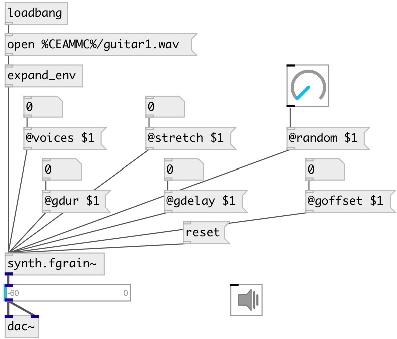

[index](index.html) :: [synth](category_synth.html)
---

# synth.fgrain~

###### file granulator from STK

*доступно с версии:* 0.6

---

## методы:

* **open**
open a monophonic soundfile to be &#34;granulated&#34;. Only WAV and AIFF formats are
supported. 
  __параметры:__
  - **[PATH]** path to file 
    тип: symbol  

* **reset**
reset the file pointer and all existing grains to the file start 

## свойства:

* **@file** 
Получить/установить path file to granulate. Only WAV and AIFF formats are supported. 
_тип:_ symbol 

* **@voices** 
Получить/установить number of simultaneous grain &#34;voices&#34; to use 
_тип:_ int 
_диапазон:_ 0..200 
_по умолчанию:_ 1 

* **@stretch** 
Получить/установить stretch factor used for grain playback (1 - 1000). Granular synthesis allows
for time-stetching without affecting the original pitch of a sound. A stretch
factor of 4 will produce a resulting sound of length 4 times the orignal sound.
The default parameter of 1 produces no stretching. 
_тип:_ int 
_диапазон:_ 1..1000 
_по умолчанию:_ 1 

* **@random** 
Получить/установить factor used when setting individual grain parameters. This random factor is
applied when all grain state durations are calculated. If set to 0.0, no
randomness occurs. When @random=0.5, a grain segment of length duration will be
randomly augmented by up to +-duration seconds (i.e., a 30 millisecond length
will be augmented by an extra length of up to +15 or -15 milliseconds) 
_тип:_ float 
_диапазон:_ 0..0.97 
_по умолчанию:_ 0.1 

* **@gramp** 
Получить/установить grain ramp. For values of @gramp greater than zero, a linear envelope will be
applied to each grain. If @gramp = 100, the resultant grain &#34;window&#34; is
triangular while @gramp = 50 produces a trapezoidal window. 
_тип:_ int 
_единица:_ % 
_диапазон:_ 1..100 
_по умолчанию:_ 50 

* **@gdur** 
Получить/установить grain duration 
_тип:_ int 
_единица:_ ms 
_минимальное значение:_ 1 
_по умолчанию:_ 30 

* **@goffset** 
Получить/установить offset parameter that controls grain pointer jumps between enveloped grain
segments. 
_тип:_ int 
_единица:_ ms 
_минимальное значение:_ 0 
_по умолчанию:_ 0 

* **@gdelay** 
Получить/установить delay parameter that causes grain calculations to pause between grains 
_тип:_ int 
_единица:_ ms 
_минимальное значение:_ 0 
_по умолчанию:_ 0 

## входы:

* control inlet 
_тип:_ control

## выходы:

* None 
_тип:_ audio

## ключевые слова:

[grain](keywords/grain.html)

**Авторы:** Serge Poltavsky

**Лицензия:** GPL3 or later

