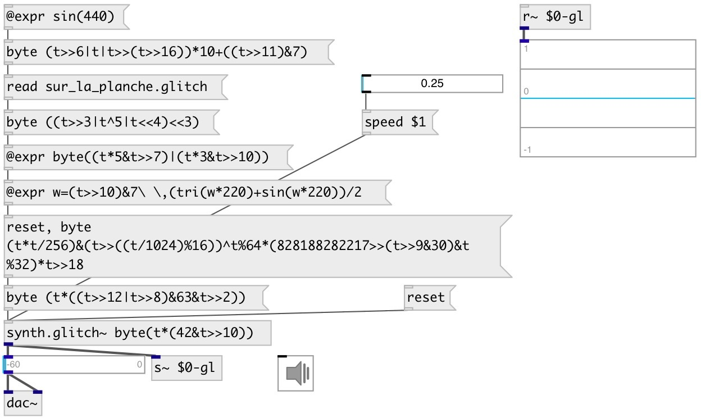

[index](index.html) :: [synth](category_synth.html)
---

# synth.glitch~

###### Glitch synthesizer by naivesound

*доступно с версии:* 0.9.1

---

## информация
A minimal, modern and easy-to-use synthesizer for Bytebeat music and not only

## аргументы:

* **EXPR**
Glitch expression 
_тип:_ list 

## методы:

* **byte**
set expression wrapper to byte() glitch function 

* **read**
read glitch synth file 
  __параметры:__
  - **PATH** path to file 
    тип: atom  
    обязательно: True  

* **reset**
reset synth 

* **speed**
set global playing speed for all synth.glitch~ objects 
  __параметры:__
  - **SPEED** speed 
    тип: float  
    обязательно: True  

## свойства:

* **@expr** 
Запросить/установить expression 
_тип:_ list 

* **@clip** 
Запросить/установить clip output to -1..+1 range. Use false value only when you are know what are
you doing and at your own risk! 
_тип:_ bool 
_по умолчанию:_ 1 

## входы:

* ... 
_тип:_ control

## выходы:

* synth output 
_тип:_ audio

## ключевые слова:

[glitch](keywords/glitch.html)

**Авторы:** naivesound, Serge Poltavsky

**Лицензия:** GPL3 or later

