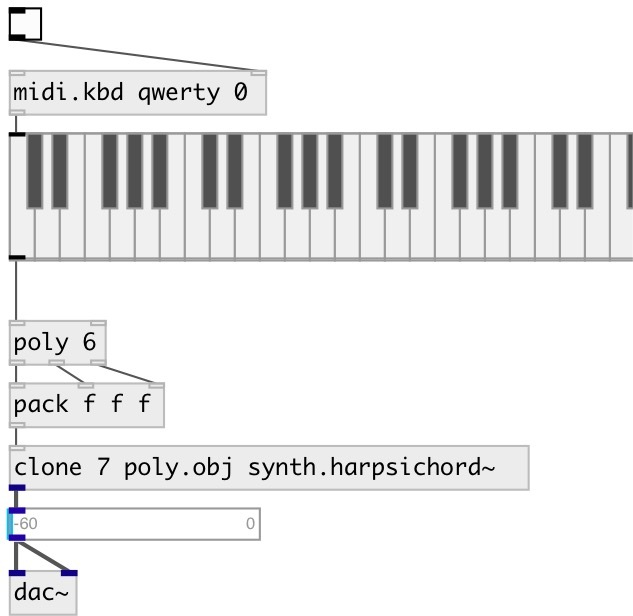

[index](index.html) :: [synth](category_synth.html)
---

# synth.harpsichord~

###### waveguide commuted harpsichord

*доступно с версии:* 0.9.2

---

## методы:

* **note**
note on/off message 
  __параметры:__
  - **NOTE** midi note 
    тип: float  
    обязательно: True  

  - **VEL** velocity 
    тип: float  
    обязательно: True  

* **reset**
reset synth 

## свойства:

* **@pitch** 
Запросить/установить midi pitch 
_тип:_ float 
_диапазон:_ 12..96 
_по умолчанию:_ 48 

* **@freq** 
Запросить/установить frequency 
_тип:_ float 
_единица:_ Hz 
_по умолчанию:_ 130.8128 

* **@room_size** 
Запросить/установить reverb room size 
_тип:_ float 
_диапазон:_ 0.005..1 
_по умолчанию:_ 0.36 

* **@nonlin** 
Запросить/установить nonlinearity factor 
_тип:_ float 
_диапазон:_ 0..1 
_по умолчанию:_ 0 

* **@modtype** 
Запросить/установить modulation type. 0=theta is modulated by the incoming signal. 1=theta is
modulated by the averaged incoming signal. 2=theta is modulated by the squared
incoming signal. 3=theta is modulated by a sine wave of frequency @modfreq.
4=theta is modulated by a sine wave of frequency @freq 
_тип:_ int 
_диапазон:_ 0..4 
_по умолчанию:_ 0 

* **@modfreq** 
Запросить/установить frequency of the sine wave for the modulation of theta (works if @modetype=3) 
_тип:_ float 
_единица:_ Hz 
_диапазон:_ 20..1000 
_по умолчанию:_ 220 

* **@reverb_gain** 
Запросить/установить reverb gain 
_тип:_ float 
_диапазон:_ 0..1 
_по умолчанию:_ 0.137 

* **@width** 
Запросить/установить spatialization width 
_тип:_ float 
_диапазон:_ 0..1 
_по умолчанию:_ 0.5 

* **@pan** 
Запросить/установить pan angle 
_тип:_ float 
_диапазон:_ 0..1 
_по умолчанию:_ 0.6 

* **@gate** 
Запросить/установить play trigger - 1: on, 0: off 
_тип:_ float 
_диапазон:_ 0..1 
_по умолчанию:_ 0 

* **@active** 
Запросить/установить on/off dsp processing 
_тип:_ bool 
_по умолчанию:_ 1 

* **@osc** (initonly)
Запросить/установить OSC server name to listen 
_тип:_ symbol 

* **@id** (initonly)
Запросить/установить OSC address id. If specified, bind all properties to
/ID/synth_harpsichord/PROP_NAME osc address, if empty bind to
/synth_harpsichord/PROP_NAME. 
_тип:_ symbol 

## входы:

* NOTE VEL 
_тип:_ control

## выходы:

* left output 
_тип:_ audio
* right output 
_тип:_ audio

## ключевые слова:

[model](keywords/model.html)
[synth](keywords/synth.html)
[harpsichord](keywords/harpsichord.html)

**Авторы:** Romain Michon, Serge Poltavsky

**Лицензия:** GPL3 or later

