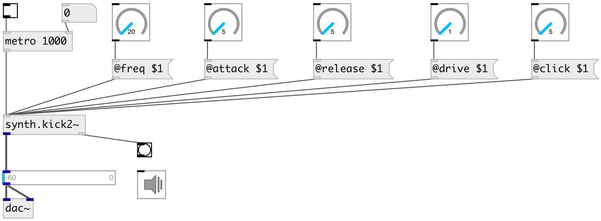

[index](index.html) :: [synth](category_synth.html)
---

# synth.kick2~

###### low-kick synth from faust librariest

*доступно с версии:* 0.9.5

---

## методы:

* **reset**
reset synth 

## свойства:

* **@gate** 
Запросить/установить play trigger &gt;0: on, 0: off. To set output gain to 0.5 you can 0.5 as trigger
value 
_тип:_ float 
_диапазон:_ 0..1 
_по умолчанию:_ 0 

* **@active** 
Запросить/установить on/off dsp processing 
_тип:_ bool 
_по умолчанию:_ 1 

* **@attack** 
Запросить/установить attack time 
_тип:_ float 
_единица:_ ms 
_диапазон:_ 5..400 
_по умолчанию:_ 20 

* **@release** 
Запросить/установить release time 
_тип:_ float 
_единица:_ ms 
_диапазон:_ 5..4000 
_по умолчанию:_ 100 

* **@envwait** 
Запросить/установить ignore new notes until previous note is not finished release time 
_тип:_ bool 
_по умолчанию:_ 0 

* **@freq** 
Запросить/установить base frequency 
_тип:_ float 
_единица:_ Hz 
_диапазон:_ 10..5000 
_по умолчанию:_ 44 

* **@click** 
Запросить/установить speed of the pitch envelope 
_тип:_ float 
_единица:_ ms 
_диапазон:_ 5..1000 
_по умолчанию:_ 20 

* **@drive** 
Запросить/установить gain multiplier going into the saturator 
_тип:_ float 
_диапазон:_ 1..10 
_по умолчанию:_ 2.5 

* **@osc** (initonly)
Запросить/установить OSC server name to listen 
_тип:_ symbol 

* **@id** (initonly)
Запросить/установить OSC address id. If specified, bind all properties to /ID/synth_kick2/PROP_NAME
osc address, if empty bind to /synth_kick2/PROP_NAME. 
_тип:_ symbol 

## входы:

* play with default duration and full gain 
_тип:_ control

## выходы:

* synth output 
_тип:_ audio
* bang after release finished 
_тип:_ control

## ключевые слова:

[synth](keywords/synth.html)
[kick](keywords/kick.html)

**Смотрите также:**
[\[synth.kick~\]](synth.kick~.html)

**Авторы:** Serge Poltavsky

**Лицензия:** GPL3 or later

