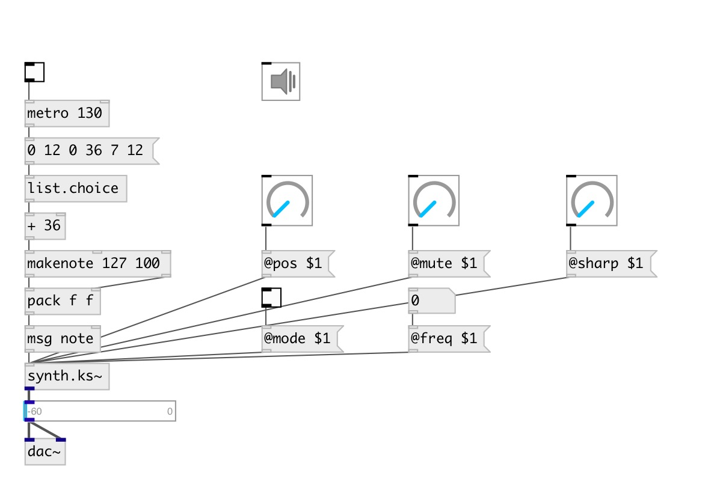

[index](index.html) :: [synth](category_synth.html)
---

# synth.ks~

###### Karplus-Strong string

*доступно с версии:* 0.6

---

## методы:

* **note**
note on/off message 
  __параметры:__
  - **NOTE** midi note 
    тип: float  
    обязательно: True  

  - **VEL** velocity 
    тип: float  
    обязательно: True  

## свойства:

* **@pitch** 
Запросить/установить midi pitch 
_тип:_ float 
_диапазон:_ 36..84 
_по умолчанию:_ 48 

* **@freq** 
Запросить/установить frequency 
_тип:_ float 
_единица:_ Hz 
_по умолчанию:_ 130.8128 

* **@pos** 
Запросить/установить pluck position (1 is on the bridge) 
_тип:_ float 
_диапазон:_ 0..1 
_по умолчанию:_ 0.7 

* **@mute** 
Запросить/установить mute coefficient (0 for no mute and 1 for instant mute) 
_тип:_ float 
_диапазон:_ 0..1 
_по умолчанию:_ 0 

* **@gain** 
Запросить/установить pluck gain 
_тип:_ float 
_диапазон:_ 0..1 
_по умолчанию:_ 1 

* **@sharp** 
Запросить/установить pluck sharpness 
_тип:_ float 
_диапазон:_ 0.01..1 
_по умолчанию:_ 0.25 

* **@cutoff** 
Запросить/установить cutoff coefficent (for low pass filter) 
_тип:_ float 
_диапазон:_ 0.1..1 
_по умолчанию:_ 1 

* **@mode** 
Запросить/установить excitation mode: 0 - impulse, 1 - pluck, 2 - strike 
_тип:_ int 
_диапазон:_ 0..2 
_по умолчанию:_ 1 

* **@gate** 
Запросить/установить play trigger - 1: on, 0: off 
_тип:_ float 
_диапазон:_ 0..1 
_по умолчанию:_ 0 

* **@active** 
Запросить/установить on/off dsp processing 
_тип:_ bool 
_по умолчанию:_ 1 

* **@osc** (initonly)
Запросить/установить OSC server name to listen 
_тип:_ symbol 

* **@id** (initonly)
Запросить/установить OSC address id. If specified, bind all properties to /ID/synth_ks/PROP_NAME osc
address, if empty bind to /synth_ks/PROP_NAME. 
_тип:_ symbol 

## входы:

* NOTE VEL 
_тип:_ control

## выходы:

* synth output 
_тип:_ audio

## ключевые слова:

[karplus](keywords/karplus.html)
[strong](keywords/strong.html)

**Авторы:** Serge Poltavsky

**Лицензия:** GPL3 or later

