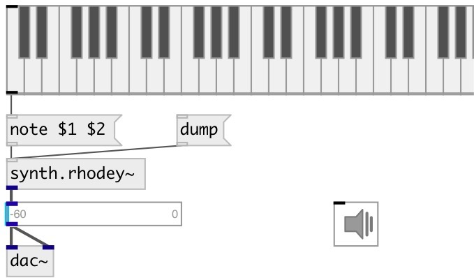

[index](index.html) :: [synth](category_synth.html)
---

# synth.rhodey~

###### STK Fender Rhodes electric piano FM synthesis instrument

*доступно с версии:* 0.6

---

## информация
This class implements two simple FM Pairs summed together, also referred to as algorithm 5 of the TX81Z

## методы:

* **cc**
Control change 
  __параметры:__
  - **CTL** control number 
    тип: int  
    обязательно: True  

  - **VAL** value 
    тип: float  
    обязательно: True  

* **note**
note on/off message 
  __параметры:__
  - **NOTE** midi note 
    тип: float  
    обязательно: True  

  - **VEL** velocity 
    тип: float  
    обязательно: True  

## свойства:

* **@pitch** 
Запросить/установить midi pitch 
_тип:_ float 
_диапазон:_ 36..84 
_по умолчанию:_ 57 

* **@freq** 
Запросить/установить maximum speed of whistles 
_тип:_ float 
_единица:_ Hz 
_диапазон:_ 0..480 
_по умолчанию:_ 220 

* **@gate** 
Запросить/установить synth gate (&gt;0 - play) 
_тип:_ float 
_диапазон:_ 0..1 
_по умолчанию:_ 0 

* **@mod** 
Запросить/установить modulator index one (cc2) 
_тип:_ int 
_диапазон:_ 0..127 
_по умолчанию:_ 0 

* **@xfade** 
Запросить/установить crossfade of outputs (cc4) 
_тип:_ int 
_диапазон:_ 0..127 
_по умолчанию:_ 0 

* **@lfo_speed** 
Запросить/установить LFO Speed (cc11) 
_тип:_ int 
_диапазон:_ 0..127 
_по умолчанию:_ 0 

* **@lfo_depth** 
Запросить/установить LFO Speed (cc1) 
_тип:_ int 
_диапазон:_ 0..127 
_по умолчанию:_ 0 

* **@adsr** 
Запросить/установить ADSR 2 &amp; 4 Target 
_тип:_ int 
_диапазон:_ 0..127 
_по умолчанию:_ 0 

## входы:

* NOTE VEL 
_тип:_ control

## выходы:

* synth output 
_тип:_ audio

## ключевые слова:

[rhodes](keywords/rhodes.html)
[fender](keywords/fender.html)
[synth](keywords/synth.html)
[fm](keywords/fm.html)

**Авторы:** Serge Poltavsky

**Лицензия:** GPL3 or later

