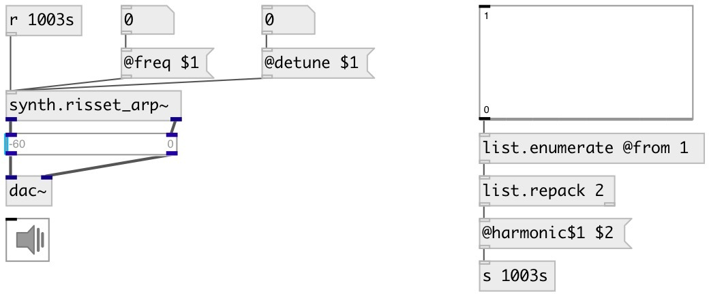

[index](index.html) :: [synth](category_synth.html)
---

# synth.risset_arp~

###### Jean Claude Risset&#39;s harmonic arpeggio effect

*доступно с версии:* 0.6

---

## свойства:

* **@freq** 
Запросить/установить base frequency 
_тип:_ float 
_диапазон:_ 40..500 
_по умолчанию:_ 100 

* **@detune** 
Запросить/установить detune percent 
_тип:_ float 
_диапазон:_ 0..1000 
_по умолчанию:_ 5 

* **@spread** 
Запросить/установить stereo spread 
_тип:_ float 
_диапазон:_ 0..1 
_по умолчанию:_ 1 

* **@harmonic1** 
Запросить/установить 1st harmonic amplitude 
_тип:_ float 
_диапазон:_ 0..1 
_по умолчанию:_ 1 

* **@harmonic2** 
Запросить/установить 2nd harmonic amplitude 
_тип:_ float 
_диапазон:_ 0..1 
_по умолчанию:_ 1 

* **@harmonic3** 
Запросить/установить 3rd harmonic amplitude 
_тип:_ float 
_диапазон:_ 0..1 
_по умолчанию:_ 1 

* **@harmonic4** 
Запросить/установить 4th harmonic amplitude 
_тип:_ float 
_диапазон:_ 0..1 
_по умолчанию:_ 1 

* **@harmonic5** 
Запросить/установить 5th harmonic amplitude 
_тип:_ float 
_диапазон:_ 0..1 
_по умолчанию:_ 1 

* **@harmonic6** 
Запросить/установить 6th harmonic amplitude 
_тип:_ float 
_диапазон:_ 0..1 
_по умолчанию:_ 1 

* **@harmonic7** 
Запросить/установить 7th harmonic amplitude 
_тип:_ float 
_диапазон:_ 0..1 
_по умолчанию:_ 1 

* **@harmonic8** 
Запросить/установить 8th harmonic amplitude 
_тип:_ float 
_диапазон:_ 0..1 
_по умолчанию:_ 1 

* **@active** 
Запросить/установить on/off dsp processing 
_тип:_ bool 
_по умолчанию:_ 1 

* **@osc** (initonly)
Запросить/установить OSC server name to listen 
_тип:_ symbol 

* **@id** (initonly)
Запросить/установить OSC address id. If specified, bind all properties to
/ID/synth_risset_arp/PROP_NAME osc address, if empty bind to
/synth_risset_arp/PROP_NAME. 
_тип:_ symbol 

## входы:

* control inlet 
_тип:_ control

## выходы:

*   
_тип:_ audio
*   
_тип:_ audio

## ключевые слова:

[risset](keywords/risset.html)
[arpeggio](keywords/arpeggio.html)

**Авторы:** Oliver Larkin, Serge Poltavsky

**Лицензия:** GPL3 or later

