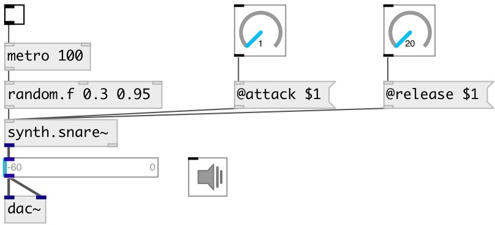

[index](index.html) :: [synth](category_synth.html)
---

# synth.snare~

###### Snare drum synth from Guitarix project

*доступно с версии:* 0.9.4

---

## методы:

* **reset**
reset synth 

## свойства:

* **@gate** 
Запросить/установить play trigger &gt;0: on, 0: off. To set output gain to 0.5 you can 0.5 as trigger
value 
_тип:_ float 
_диапазон:_ 0..1 
_по умолчанию:_ 0 

* **@active** 
Запросить/установить on/off dsp processing 
_тип:_ bool 
_по умолчанию:_ 1 

* **@attack** 
Запросить/установить attack time 
_тип:_ float 
_единица:_ ms 
_диапазон:_ 0.3..100 
_по умолчанию:_ 0.5 

* **@decay** 
Запросить/установить decay time 
_тип:_ float 
_единица:_ ms 
_диапазон:_ 1..100 
_по умолчанию:_ 1 

* **@release** 
Запросить/установить release time 
_тип:_ float 
_единица:_ ms 
_диапазон:_ 10..1000 
_по умолчанию:_ 200 

* **@envwait** 
Запросить/установить ignore new notes until previous note is not finished release time 
_тип:_ bool 
_по умолчанию:_ 0 

* **@osc** (initonly)
Запросить/установить OSC server name to listen 
_тип:_ symbol 

* **@id** (initonly)
Запросить/установить OSC address id. If specified, bind all properties to /ID/synth_snare/PROP_NAME
osc address, if empty bind to /synth_snare/PROP_NAME. 
_тип:_ symbol 

## входы:

* play with default duration and full gain 
_тип:_ control

## выходы:

* synth output 
_тип:_ audio
* bang after release finished 
_тип:_ control

## ключевые слова:

[synth](keywords/synth.html)
[snare](keywords/snare.html)
[drum](keywords/drum.html)

**Авторы:** Serge Poltavsky

**Лицензия:** GPL3 or later

