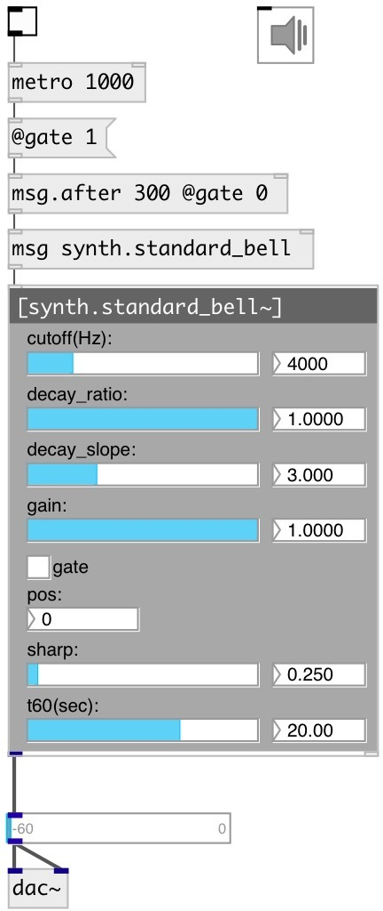

[index](index.html) :: [synth](category_synth.html)
---

# synth.standard_bell~

###### german church bell modal model

*доступно с версии:* 0.9.4

---

## информация
Modeled after D. Bartocha and . Baron, Influence of Tin Bronze Melting and Pouring Parameters on Its Properties and Bell&#39; Tone, Archives of Foundry Engineering, 2016 Model height is 1.8m This model contains 7 excitation positions going linearly from the bottom to the top of the bell

## методы:

* **reset**
reset synth 

## свойства:

* **@pos** 
Получить/установить strike position (0 is on the bottom) 
_тип:_ int 
_диапазон:_ 0..6 
_по умолчанию:_ 0 

* **@gain** 
Получить/установить strike gain 
_тип:_ float 
_диапазон:_ 0..1 
_по умолчанию:_ 1 

* **@sharp** 
Получить/установить strike sharpness 
_тип:_ float 
_диапазон:_ 0.01..5 
_по умолчанию:_ 0.25 

* **@cutoff** 
Получить/установить strike cutoff frequency 
_тип:_ float 
_единица:_ Hz 
_диапазон:_ 20..20000 
_по умолчанию:_ 4000 

* **@t60** 
Получить/установить time to decay to -60db level 
_тип:_ float 
_единица:_ sec 
_диапазон:_ 0.1..30 
_по умолчанию:_ 20 

* **@decay_ratio** 
Получить/установить decay ratio 
_тип:_ float 
_диапазон:_ 0..1 
_по умолчанию:_ 1 

* **@decay_slope** 
Получить/установить decay slope 
_тип:_ float 
_диапазон:_ 0..10 
_по умолчанию:_ 3 

* **@gate** 
Получить/установить play trigger - 1: on, 0: off 
_тип:_ float 
_диапазон:_ 0..1 
_по умолчанию:_ 0 

* **@active** 
Получить/установить on/off dsp processing 
_тип:_ int 
_варианты:_ 0, 1 
_по умолчанию:_ 1 

## входы:

* play 
_тип:_ control

## выходы:

* output signal 
_тип:_ audio

## ключевые слова:

[bell](keywords/bell.html)
[church](keywords/church.html)
[german](keywords/german.html)

**Авторы:** Serge Poltavsky

**Лицензия:** GPL3 or later

