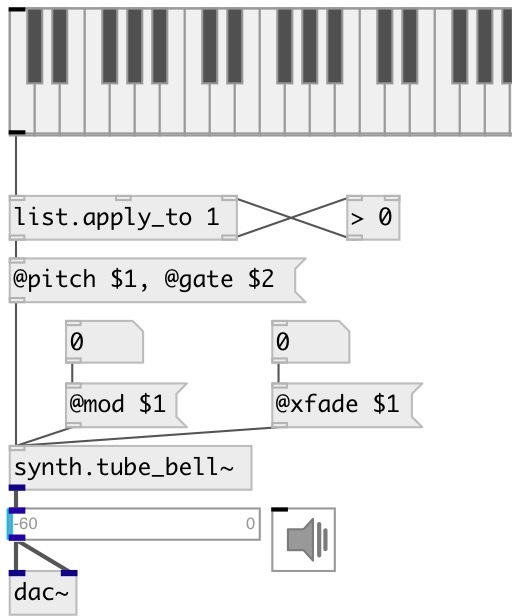

[index](index.html) :: [synth](category_synth.html)
---

# synth.tube_bell~

###### STK tubular bell (orchestral chime) FM synthesis instrument

*доступно с версии:* 0.9.4

---

## информация
This class implements two simple FM Pairs summed together, also referred to as algorithm 5 of the TX81Z

## аргументы:

* **FREQ**
main frequency 
_тип:_ float 
_единица:_ Hz 

## методы:

* **note**
note on/off message 
  __параметры:__
  - **NOTE** midi note 
    тип: float  
    обязательно: True  

  - **VEL** velocity 
    тип: float  
    обязательно: True  

* **cc**
control change message 
  __параметры:__
  - **CTL** control number 
    тип: int  
    обязательно: True  

  - **VAL** value 
    тип: float  
    обязательно: True  

## свойства:

* **@freq** 
Запросить/установить frequency 
_тип:_ float 
_единица:_ Hz 
_диапазон:_ 0..10000 
_по умолчанию:_ 220 

* **@pitch** 
Запросить/установить midi pitch 
_тип:_ float 
_диапазон:_ 36..84 
_по умолчанию:_ 57 

* **@gate** 
Запросить/установить play trigger - 1: on, 0: off 
_тип:_ float 
_диапазон:_ 0..1 
_по умолчанию:_ 0 

* **@mod** 
Запросить/установить modulator index one 
_тип:_ int 
_диапазон:_ 0..127 
_по умолчанию:_ 0 

* **@xfade** 
Запросить/установить crossfade of outputs 
_тип:_ int 
_диапазон:_ 0..127 
_по умолчанию:_ 0 

* **@lfo_speed** 
Запросить/установить LFO speed in Hz 
_тип:_ int 
_диапазон:_ 0..127 
_по умолчанию:_ 0 

* **@lfo_depth** 
Запросить/установить LFO delth 
_тип:_ int 
_диапазон:_ 0..127 
_по умолчанию:_ 0 

* **@adsr** 
Запросить/установить ADSR 2 &amp; 4 Target 
_тип:_ int 
_диапазон:_ 0..127 
_по умолчанию:_ 0 

## входы:

* NOTE VEL 
_тип:_ control

## выходы:

* synth output 
_тип:_ audio

## ключевые слова:

[tubular](keywords/tubular.html)
[stk](keywords/stk.html)
[bell](keywords/bell.html)

**Авторы:** Serge Poltavsky

**Лицензия:** GPL3 or later

