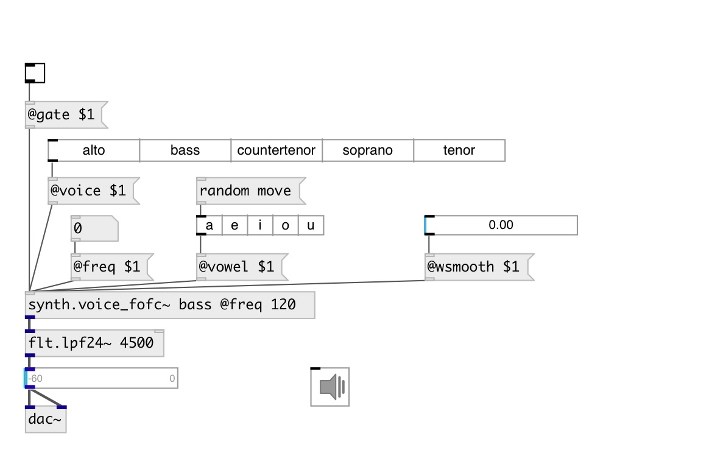

[index](index.html) :: [synth](category_synth.html)
---

# synth.voice_fofc~

###### Simple formant/vocal synthesizer with FOF-cycle filterbank.

*доступно с версии:* 0.9.6

---

## информация
Simple formant/vocal synthesizer based on a source/filter model. The source is just a periodic impulse and the &#34;filter&#34; is a bank of FOF filters. Formant parameters are linearly interpolated allowing to go smoothly from one vowel to another. Voice type can be selected but must correspond to the frequency range of the synthesized voice to be realistic. A cycle of 12 FOF filters with sample-and-hold is used so that the fof filter parameters can be varied in realtime. This technique is more robust but more computationally expensive than FofSmooth

## аргументы:

* **VOICE**
voice type 
_тип:_ symbol 

* **VOWEL**
vowel 
_тип:_ symbol 

## свойства:

* **@freq** 
Запросить/установить frequency 
_тип:_ float 
_единица:_ Hz 
_диапазон:_ 20..20000.0 
_по умолчанию:_ 440 

* **@gate** 
Запросить/установить synth gate (&gt;0 - play) 
_тип:_ bool 
_по умолчанию:_ 0 

* **@vibr_freq** 
Запросить/установить vibrato frequency 
_тип:_ float 
_единица:_ Hz 
_диапазон:_ 1..10 
_по умолчанию:_ 6 

* **@vibr_gain** 
Запросить/установить vibrato frequency 
_тип:_ float 
_диапазон:_ 0..1 
_по умолчанию:_ 0.5 

* **@voice** 
Запросить/установить voice type. Note: can be set by corresponding index. 
_тип:_ symbol 
_варианты:_ alto, bass, countertenor, soprano, tenor 
_по умолчанию:_ alto 

* **@vowel** 
Запросить/установить vowel type. Note: can be set by corresponding index. 
_тип:_ symbol 
_варианты:_ a, e, i, o, u 
_по умолчанию:_ a 

* **@attack** 
Запросить/установить attack time 
_тип:_ float 
_единица:_ ms 
_диапазон:_ 0..1000 
_по умолчанию:_ 30 

* **@release** 
Запросить/установить release time 
_тип:_ float 
_единица:_ ms 
_диапазон:_ 0..1000 
_по умолчанию:_ 50 

* **@active** 
Запросить/установить on/off dsp processing 
_тип:_ bool 
_по умолчанию:_ 1 

* **@portamento** 
Запросить/установить portamento time 
_тип:_ float 
_единица:_ ms 
_диапазон:_ 0..4000 
_по умолчанию:_ 0 

* **@wsmooth** 
Запросить/установить vowel smoothing time 
_тип:_ float 
_единица:_ ms 
_диапазон:_ 0..1000 
_по умолчанию:_ 10 

* **@fvowel** 
Запросить/установить vowel index: 0=a, 1=e, 2=i, 3=o, 4=u. Float values can be interpoltaed. 
_тип:_ float 
_диапазон:_ 0..4 
_по умолчанию:_ 0 

* **@osc** (initonly)
Запросить/установить OSC server name to listen 
_тип:_ symbol 

* **@id** (initonly)
Запросить/установить OSC address id. If specified, bind all properties to
/ID/synth_voice_fofc/PROP_NAME osc address, if empty bind to
/synth_voice_fofc/PROP_NAME. 
_тип:_ symbol 

## входы:

* control input 
_тип:_ control

## выходы:

* synth output 
_тип:_ audio

## ключевые слова:

[voice](keywords/voice.html)
[fof](keywords/fof.html)
[voice](keywords/voice.html)
[cycle](keywords/cycle.html)

**Смотрите также:**
[\[synth.voice_fofs~\]](synth.voice_fofs~.html)

**Авторы:** Serge Poltavsky

**Лицензия:** GPL3 or later

