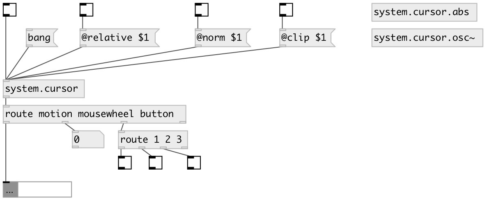

[index](index.html) :: [system](category_system.html)
---

# system.cursor

###### Output cursor motion, mousewheel and button clicks

*доступно с версии:* 0.1

---

## свойства:

* **@relative** 
Получить/установить relative output mode: if on output coords relative to window, otherwise output
screen coordinates 
_тип:_ int 
_варианты:_ 0, 1 
_по умолчанию:_ 0 

* **@norm** 
Получить/установить cursor x/y coordinates normalization by screen (or window) width/height 
_тип:_ int 
_варианты:_ 0, 1 
_по умолчанию:_ 0 

## входы:

* output cursor position 
_тип:_ control

## выходы:

* messages: motion X Y, mousewheel DELTA, button IDX STATE 
_тип:_ control

## ключевые слова:

[cursor](keywords/cursor.html)
[mouse](keywords/mouse.html)
[mousewheel](keywords/mousewheel.html)

**Авторы:** Hans-Christoph Steiner, Serge Poltavski

**Лицензия:** GPL3 or later

