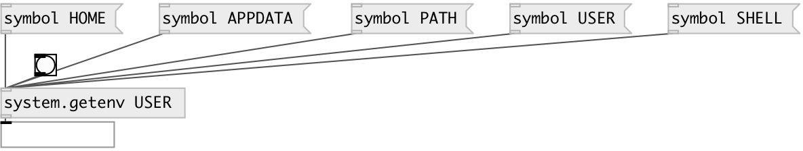

[index](index.html) :: [system](category_system.html)
---

# system.getenv

###### Get system environment variables

*доступно с версии:* 0.1

---

## аргументы:

* **VAR**
environment variable name 
_тип:_ symbol 

## входы:

* outputs variable value 
_тип:_ control

## выходы:

* symbol: env-variable value 
_тип:_ control

## ключевые слова:

[system](keywords/system.html)
[environment](keywords/environment.html)

**Смотрите также:**
[\[system.hostname\]](system.hostname.html)

**Авторы:** Alex Nadzharov, Serge Poltavsky

**Лицензия:** GPL3 or later

