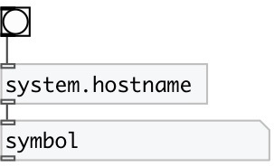

[index](index.html) :: [system](category_system.html)
---

# system.hostname

###### outputs system hostname

*доступно с версии:* 0.1

---

## входы:

* outputs hostname 
_тип:_ control

## выходы:

* symbol: hostname 
_тип:_ control

## ключевые слова:

[system](keywords/system.html)
[hostname](keywords/hostname.html)

**Авторы:** Serge Poltavsky

**Лицензия:** GPL3 or later

