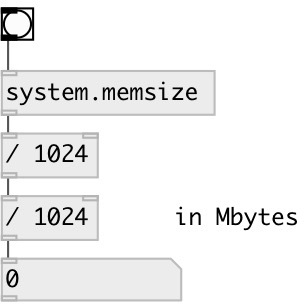

[index](index.html) :: [system](category_system.html)
---

# system.memsize

###### returns the size of physical memory (RAM) in bytes round to float data type.

*доступно с версии:* 0.1

---

## входы:

* outputs memory size 
_тип:_ control

## выходы:

* physical memory (RAM) size in bytes 
_тип:_ control

## ключевые слова:

[system](keywords/system.html)
[memory](keywords/memory.html)

**Смотрите также:**
[\[system.memused\]](system.memused.html)

**Авторы:** Serge Poltavsky

**Лицензия:** GPL3 or later

