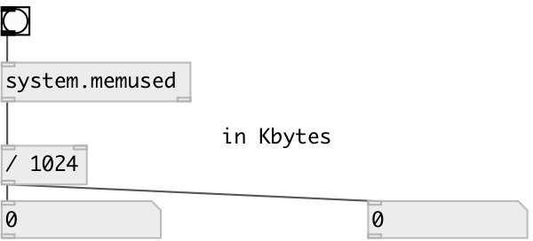

[index](index.html) :: [system](category_system.html)
---

# system.memused

###### returns the process physical memory use - current and peak

*доступно с версии:* 0.1

---

## входы:

* outputs memory use 
_тип:_ control

## выходы:

* current physical memory use measured in bytes, or zero if the value cannot be determined on this OS. 
_тип:_ control
* peak (maximum so far) physical memory use measured in bytes, or zero if the value cannot be determined on this OS. 
_тип:_ control

## ключевые слова:

[system](keywords/system.html)
[memory](keywords/memory.html)

**Смотрите также:**
[\[system.memsize\]](system.memsize.html)

**Авторы:** Serge Poltavsky

**Лицензия:** GPL3 or later

