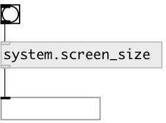

[index](index.html) :: [system](category_system.html)
---

# system.screen_size

###### returns current screen size in pixels

*доступно с версии:* 0.1

---

## входы:

* outputs screen size in pixels 
_тип:_ control

## выходы:

* list of two values: width and height 
_тип:_ control

## ключевые слова:

[screen](keywords/screen.html)
[info](keywords/info.html)

**Авторы:** Serge Poltavsky

**Лицензия:** GPL3 or later

