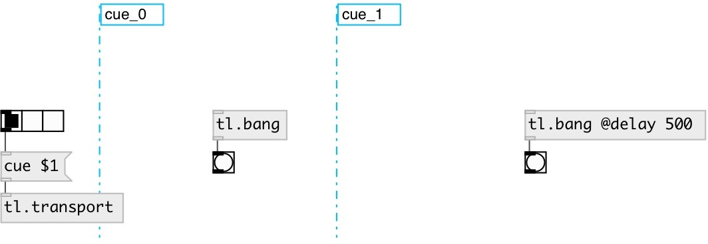

[index](index.html) :: [tl](category_tl.html)
---

# tl.bang

###### Timeline bang (with possible delay)

*доступно с версии:* 0.1

---

## информация
Bang only when nearest left tl.cue was activated. If other cue is activated and bang was scheduled by @delay property - it canceled

## свойства:

* **@delay** 
Получить/установить bang delay after cue activation 
_тип:_ float 
_единица:_ ms 
_минимальное значение:_ 0 
_по умолчанию:_ 0 

* **@cue** (readonly)
Получить related cue 
_тип:_ symbol 

## входы:

* control inlet 
_тип:_ control

## выходы:

* bang output 
_тип:_ control

## ключевые слова:

[timeline](keywords/timeline.html)
[bang](keywords/bang.html)

**Смотрите также:**
[\[tl.toggle\]](tl.toggle.html)
[\[tl.cue\]](tl.cue.html)

**Авторы:** Alex Nadzharov, Serge Poltavsky

**Лицензия:** GPL3 or later

