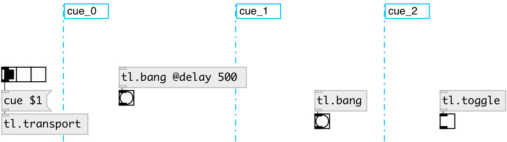

[index](index.html) :: [tl](category_tl.html)
---

# tl.cue

###### Timeline section

*доступно с версии:* 0.1

---

## методы:

* **pos**
set UI element position 
  __параметры:__
  - **X** top left x-coord 
    тип: float  
    обязательно: True  

  - **Y** top right y-coord 
    тип: float  
    обязательно: True  

## свойства:

* **@pinned** 
Запросить/установить pin mode. if 1 - put element to the lowest level 
_тип:_ bool 
_по умолчанию:_ 0 

* **@background_color** 
Запросить/установить element background color (list of red, green, blue values in 0-1 range) 
_тип:_ list 
_по умолчанию:_ 0.93 0.93 0.93 1 

* **@border_color** 
Запросить/установить border color (list of red, green, blue values in 0-1 range) 
_тип:_ list 
_по умолчанию:_ 0 0.75 1 1 

* **@fontsize** 
Запросить/установить fontsize 
_тип:_ int 
_диапазон:_ 4..100 
_по умолчанию:_ 11 

* **@fontname** 
Запросить/установить fontname 
_тип:_ symbol 
_варианты:_ Courier, DejaVu, Helvetica, Monaco, Times 
_по умолчанию:_ Helvetica 

## ключевые слова:

[timeline](keywords/timeline.html)
[cue](keywords/cue.html)

**Смотрите также:**
[\[tl.bang\]](tl.bang.html)
[\[tl.toggle\]](tl.toggle.html)

**Авторы:** Alex Nadzharov, Serge Poltavsky

**Лицензия:** GPL3 or later

