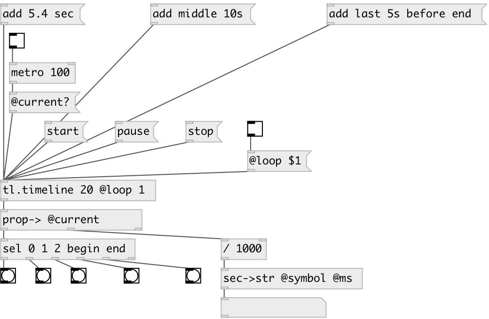

[index](index.html) :: [tl](category_tl.html)
---

# tl.timeline

###### Timeline - event scheduler

*доступно с версии:* 0.7

---

## информация
With timeline you can schedule your events and start/pause/stop/move time This time formats for event are supported: *clock format* - HH:MM:SS.MS, or values like NUMBER UNIT: 10 ms, 10 msec, 20 sec, 30.5s. Note: spaces are ignored. Empty timeline always contains &#34;end&#34; event, that can&#39;t be removed. Events are referred by name or by index. Negative indexes are supported: -1 means last event (not &#34;end&#34; event, but last user event)

## аргументы:

* **LENGTH**
timeline length 
_тип:_ float 
_единица:_ sec 

## методы:

* **add**
add event to timeline. You can use simple syntax like [add 10.1 sec( to create
event with default name, or use advanced: [add myEvent 510ms before end( 
  __параметры:__
  - **[NAME=eventN]** event name (if ommitted, autogenerated name is used: event1, event2 etc.) 
    тип: symbol  

  - **[TIME]** event time: see *info* section 
    тип: list  

  - **[relative]** create relative event before or after target event 
    тип: symbol  

  - **[REL_EVENT]** relative event name 
    тип: symbol  

* **clear**
remove all timeline events 

* **pause**
stops timeline at current position 

* **remove**
remove event by given index or name. [remove event1( or [remove 3( 
  __параметры:__
  - **[NAME|IDX]** event name or index 
    тип: atom  

* **remove_at**
remove event at specified time 
  __параметры:__
  - **[TIME]** time in supported format. See *info* section 
    тип: list  

* **reset**
reset timeline (call only when stopped) 

* **start**
start timeline from current position 

* **stop**
stops timeline and reset current position to the beginning 

* **to_event**
move time to specified event 
  __параметры:__
  - **[NAME|IDX]** event or index 
    тип: atom  

* **to_time**
move time to time 
  __параметры:__
  - **[TIME]** time in supported format. See *info* section 
    тип: list  

## свойства:

* **@is_running** (readonly)
Запросить if timeline is running 
_тип:_ bool 
_по умолчанию:_ 0 

* **@length** (initonly)
Запросить/установить timeline length 
_тип:_ float 
_единица:_ sec 
_минимальное значение:_ 0 
_по умолчанию:_ 60 

* **@size** (readonly)
Запросить number of events in timeline 
_тип:_ int 
_минимальное значение:_ 0 
_по умолчанию:_ 1 

* **@current** (readonly)
Запросить current time 
_тип:_ float 
_единица:_ ms 
_по умолчанию:_ 0 

* **@current_sec** (readonly)
Запросить current time 
_тип:_ float 
_единица:_ sec 
_по умолчанию:_ 0 

* **@phase** (readonly)
Запросить current phase in [0-1) range 
_тип:_ float 
_диапазон:_ 0..1 
_по умолчанию:_ 0 

* **@events** (readonly)
Запросить list of event names in chronological order 
_тип:_ list 
_по умолчанию:_ end 

* **@loop** 
Запросить/установить loop mode 
_тип:_ bool 
_по умолчанию:_ 0 

* **@mode** 
Запросить/установить timeline mode. If timeline is fixed, when reached, it outputs *end* event and
stops after that. Infinite timeline never stops by itself. Fixed timeline can
have @loop property for repeats 
_тип:_ symbol 
_варианты:_ fixed, inf 
_по умолчанию:_ fixed 

## входы:

* control inlet. Non-zero value starts timeline, zero - stops. 
_тип:_ control

## выходы:

* list: event index, event name, current event time 
_тип:_ control

## ключевые слова:

[timeline](keywords/timeline.html)

**Смотрите также:**
[\[tl.cue\]](tl.cue.html)

**Авторы:** Serge Poltavsky

**Лицензия:** GPL3 or later

