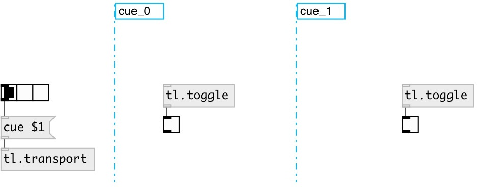

[index](index.html) :: [tl](category_tl.html)
---

# tl.toggle

###### Timeline bang

*доступно с версии:* 0.7

---

## информация
Output 1 when cue section activated, 0 when switched to other cue section

## свойства:

* **@cue** (readonly)
Запросить related cue 
_тип:_ symbol 

## входы:

* control inlet 
_тип:_ control

## выходы:

* 1 on cue enter, 0 on cue out 
_тип:_ control

## ключевые слова:

[timeline](keywords/timeline.html)
[toggle](keywords/toggle.html)

**Смотрите также:**
[\[tl.bang\]](tl.bang.html)
[\[tl.cue\]](tl.cue.html)

**Авторы:** Alex Nadzharov, Serge Poltavsky

**Лицензия:** GPL3 or later

