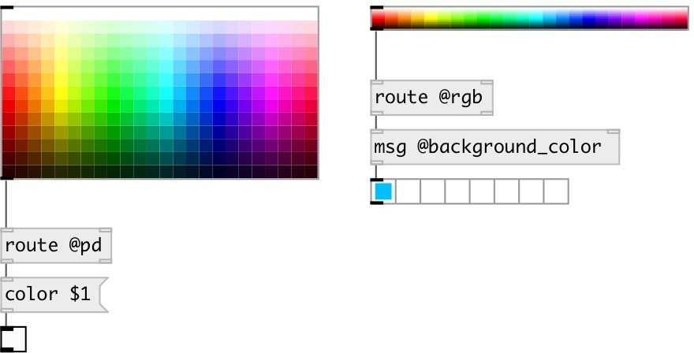

[index](index.html) :: [ui](category_ui.html)
---

# ui.colorpanel

###### colorchooser widget

*доступно с версии:* 0.1

---

## методы:

* **set**
set widget value with no output 
  __параметры:__
  - **COL** column index 
    тип: int  
    обязательно: True  

  - **ROW** row index 
    тип: int  
    обязательно: True  

* **load**
loads specified preset 
  __параметры:__
  - **IDX** preset index 
    тип: int  
    обязательно: True  

* **store**
stores specified preset 
  __параметры:__
  - **IDX** preset index 
    тип: int  
    обязательно: True  

* **clear**
clears specified preset 
  __параметры:__
  - **IDX** preset index 
    тип: int  
    обязательно: True  

* **interp**
for this object acts as *load*, no interpolation performed 

* **pos**
set UI element position 
  __параметры:__
  - **X** top left x-coord 
    тип: float  
    обязательно: True  

  - **Y** top right y-coord 
    тип: float  
    обязательно: True  

## свойства:

* **@matrix** 
Запросить/установить matrix size 
_тип:_ list 
_по умолчанию:_ 24 13 

* **@index** 
Запросить/установить color position in panel 
_тип:_ list 

* **@reverse** 
Запросить/установить matrix reversed 
_тип:_ bool 
_по умолчанию:_ 0 

* **@saturation** 
Запросить/установить saturation 
_тип:_ float 
_диапазон:_ 0..1 
_по умолчанию:_ 1 

* **@hue** 
Запросить/установить first hue 
_тип:_ float 
_диапазон:_ 0..1 
_по умолчанию:_ 0 

* **@lightness** 
Запросить/установить first lightness 
_тип:_ float 
_диапазон:_ 0..1 
_по умолчанию:_ 1 

* **@pd** (readonly)
Запросить pd color value 
_тип:_ int 
_по умолчанию:_ 0 

* **@rgb** (readonly)
Запросить RGB value triplet on 0-1 range 
_тип:_ list 

* **@hsl** (readonly)
Запросить HSL value triplet on 0-1 range 
_тип:_ list 

* **@hex** (readonly)
Запросить HEX value in format #RRGGBB 
_тип:_ symbol 

* **@presetname** 
Запросить/установить preset name for using with [ui.preset] 
_тип:_ symbol 
_по умолчанию:_ (null) 

* **@send** 
Запросить/установить send destination 
_тип:_ symbol 
_по умолчанию:_ (null) 

* **@receive** 
Запросить/установить receive source 
_тип:_ symbol 
_по умолчанию:_ (null) 

* **@size** 
Запросить/установить element size (width, height pair) 
_тип:_ list 
_по умолчанию:_ 181 105 

* **@pinned** 
Запросить/установить pin mode. if 1 - put element to the lowest level 
_тип:_ bool 
_по умолчанию:_ 0 

* **@background_color** 
Запросить/установить element background color (list of red, green, blue values in 0-1 range) 
_тип:_ list 
_по умолчанию:_ 0.93 0.93 0.93 1 

* **@border_color** 
Запросить/установить border color (list of red, green, blue values in 0-1 range) 
_тип:_ list 
_по умолчанию:_ 0.6 0.6 0.6 1 

* **@fontsize** 
Запросить/установить fontsize 
_тип:_ int 
_диапазон:_ 4..100 
_по умолчанию:_ 11 

* **@fontname** 
Запросить/установить fontname 
_тип:_ symbol 
_варианты:_ Courier, DejaVu, Helvetica, Monaco, Times 
_по умолчанию:_ Helvetica 

* **@fontweight** 
Запросить/установить font weight 
_тип:_ symbol 
_варианты:_ normal, bold 
_по умолчанию:_ normal 

* **@fontslant** 
Запросить/установить font slant 
_тип:_ symbol 
_варианты:_ roman, italic 
_по умолчанию:_ roman 

## входы:

* outputs current widget value 
_тип:_ control

## выходы:

* output values: @pd COLOR, @rgb in range [0-1], @hsl in range [0-1], @hex 
_тип:_ control

## ключевые слова:

[ui](keywords/ui.html)
[color](keywords/color.html)
[choose](keywords/choose.html)

**Смотрите также:**
[\[ui.number\]](ui.number.html)

**Авторы:** Pierre Guillot, Serge Poltavsky

**Лицензия:** GPL3 or later

