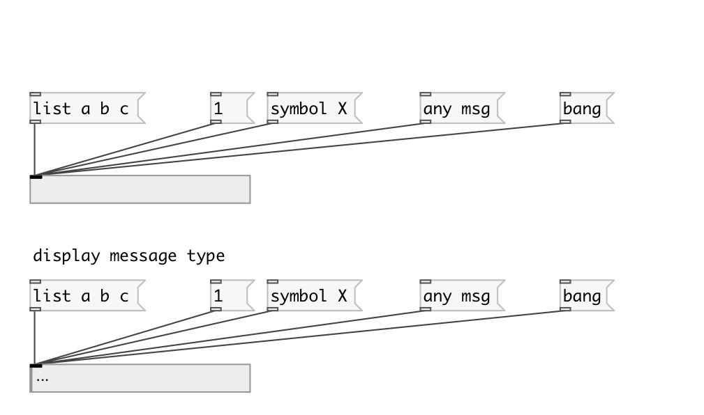

[< справка — содержание](index.html)
---

# ui.display

Виджет - &#34;дисплей&#34;

---

 

---

---
аргументы:

---
свойства:

@auto_size: включите для того, чтобы размер объекта автоматически устанавливался в соотсветствии с размером входящего сообщения 
@display_type: флаг отображания типа входящего сообщения 
@display_events: флаг для визуальной индикации (мигание цветом) входящих сообщений 
@send: адрес для отправки сообщения (send) 
@receive: имя источника сообщений (receive) 
@size: размер виджета (пара значений: ширина, высота) 
@pinned: режим  if 1 - put element
            to the lowest level 
@active_color: активный цвет (список значений для красного, зеленого и синего цветов в диапазоне 0..1) 
@background_color: цвет фона (список значений для красного, зеленого и синего цветов в диапазоне 0..1) 
@border_color: цвет рамки (список значений для красного, зеленого и синего цветов в диапазоне 0..1) 
@fontsize: 
            размер шрифта 
@fontname: название шрифта 
@fontweight: жирный шрифт 
@fontslant: курсивный шрифт 

---
смотрите также: 

