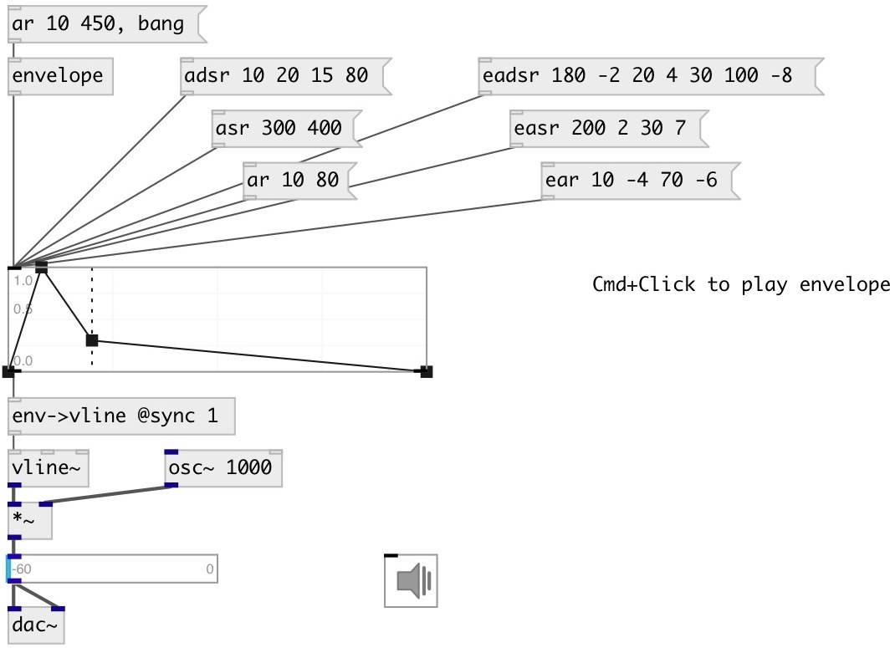

[index](index.html) :: [ui](category_ui.html)
---

# ui.env

###### envelope editor widget

*доступно с версии:* 0.5

---

## информация
Editor of sound envelope function

## методы:

* **adsr**
creates ADSR envelope with one stop point 
  __параметры:__
  - **ATTACK** attack time 
    тип: float  
    единица: ms  
    обязательно: True  

  - **DECAY** decay time 
    тип: float  
    единица: ms  
    обязательно: True  

  - **SUSTAIN** sustain level 
    тип: float  
    единица: %  
    обязательно: True  

  - **RELEASE** release time 
    тип: float  
    единица: ms  
    обязательно: True  

* **asr**
creates ASR envelope with one stop point 
  __параметры:__
  - **ATTACK** attack time 
    тип: float  
    единица: ms  
    обязательно: True  

  - **RELEASE** release time 
    тип: float  
    единица: ms  
    обязательно: True  

* **ar**
creates AR envelope without stop points 
  __параметры:__
  - **ATTACK** attack time 
    тип: float  
    единица: ms  
    обязательно: True  

  - **RELEASE** release time 
    тип: float  
    единица: ms  
    обязательно: True  

* **eadsr**
creates exponential ADSR envelope with one stop point 
  __параметры:__
  - **ATTACK** attack time 
    тип: float  
    единица: ms  
    обязательно: True  

  - **ATTACK_CURVE** attack segment curve 
    тип: float  
    обязательно: True  

  - **DECAY** decay time 
    тип: float  
    единица: ms  
    обязательно: True  

  - **DECAY_CURVE** decay segment curve 
    тип: float  
    обязательно: True  

  - **SUSTAIN** sustain level 
    тип: float  
    единица: %  
    обязательно: True  

  - **RELEASE** release time 
    тип: float  
    единица: ms  
    обязательно: True  

  - **RELEASE_CURVE** release segment curve 
    тип: float  
    обязательно: True  

* **easr**
creates exponential AR envelope with one stop point 
  __параметры:__
  - **ATTACK** attack time 
    тип: float  
    единица: ms  
    обязательно: True  

  - **ATTACK_CURVE** attack segment curve 
    тип: float  
    обязательно: True  

  - **RELEASE** release time 
    тип: float  
    единица: ms  
    обязательно: True  

  - **RELEASE_CURVE** release segment curve 
    тип: float  
    обязательно: True  

* **ear**
creates exponential AR envelope without stop points 
  __параметры:__
  - **ATTACK** attack time 
    тип: float  
    единица: ms  
    обязательно: True  

  - **ATTACK_CURVE** attack segment curve 
    тип: float  
    обязательно: True  

  - **RELEASE** release time 
    тип: float  
    единица: ms  
    обязательно: True  

  - **RELEASE_CURVE** release segment curve 
    тип: float  
    обязательно: True  

* **step**
creates step-segmented envelope with arbitrary number of segments 
  __параметры:__
  - **VAL0** begin value 
    тип: float  
    обязательно: True  

  - **LEN0** step length 
    тип: float  
    единица: ms  
    обязательно: True  

  - **VAL1** value 
    тип: float  
    обязательно: True  

  - **[LEN1]** segment length 
    тип: float  

  - **[VAL2]** value 
    тип: float  

* **line**
creates line-segmented envelope with arbitrary number of segments 
  __параметры:__
  - **VAL0** begin value 
    тип: float  
    обязательно: True  

  - **LEN0** line length 
    тип: float  
    единица: ms  
    обязательно: True  

  - **VAL1** value 
    тип: float  
    обязательно: True  

  - **[LEN1]** segment length 
    тип: float  

  - **[VAL2]** value 
    тип: float  

* **sin2**
creates quadratic sine-segmented envelope with arbitrary number of segments 
  __параметры:__
  - **VAL0** begin value 
    тип: float  
    обязательно: True  

  - **LEN0** line length 
    тип: float  
    единица: ms  
    обязательно: True  

  - **VAL1** value 
    тип: float  
    обязательно: True  

  - **[LEN1]** segment length 
    тип: float  

  - **[VAL2]** value 
    тип: float  

* **exp**
creates exponential-segmented envelope with arbitrary number of segments 
  __параметры:__
  - **VAL0** begin value 
    тип: float  
    обязательно: True  

  - **LEN0** line length 
    тип: float  
    единица: ms  
    обязательно: True  

  - **CURVE0** segment curve 
    тип: float  
    обязательно: True  

  - **VAL1** value 
    тип: float  
    обязательно: True  

  - **[LEN1]** segment length 
    тип: float  

  - **[CURVE1]** segment curve 
    тип: float  

  - **[VAL2]** value 
    тип: float  

* **sigmoid**
creates sigmoid-segmented envelope with arbitrary number of segments 
  __параметры:__
  - **VAL0** begin value 
    тип: float  
    обязательно: True  

  - **LEN0** line length 
    тип: float  
    единица: ms  
    обязательно: True  

  - **CURVE0** segment curve 
    тип: float  
    обязательно: True  

  - **VAL1** value 
    тип: float  
    обязательно: True  

  - **[LEN1]** segment length 
    тип: float  

  - **[CURVE1]** segment curve 
    тип: float  

  - **[VAL2]** value 
    тип: float  

* **clear**
clear specified preset 
  __параметры:__
  - **IDX** preset index 
    тип: int  
    обязательно: True  

* **load**
loads specified preset 
  __параметры:__
  - **IDX** preset index 
    тип: int  
    обязательно: True  

* **store**
stores specified preset 
  __параметры:__
  - **IDX** preset index 
    тип: int  
    обязательно: True  

* **interp**
for this object acts as *load*, no interpolation performed 

* **at**
output envelope value at specified position to second outlet 
  __параметры:__
  - **VAL** position (in milliseconds if unit arg is ommited ) 
    тип: float  
    обязательно: True  

  - **[UNIT]** position unit: ms, % or *(phase) 
    тип: symbol  

* **pos**
set UI element position 
  __параметры:__
  - **X** top left x-coord 
    тип: float  
    обязательно: True  

  - **Y** top right y-coord 
    тип: float  
    обязательно: True  

## свойства:

* **@length** 
Получить/установить envelope time length 
_тип:_ float 
_единица:_ ms 
_минимальное значение:_ 10 
_по умолчанию:_ 400 

* **@presetname** 
Получить/установить preset name for using with [ui.preset] 
_тип:_ symbol 
_по умолчанию:_ (null) 

* **@send** 
Получить/установить send destination 
_тип:_ symbol 
_по умолчанию:_ (null) 

* **@receive** 
Получить/установить receive source 
_тип:_ symbol 
_по умолчанию:_ (null) 

* **@size** 
Получить/установить element size (width, height pair) 
_тип:_ list 
_по умолчанию:_ 200 150 

* **@pinned** 
Получить/установить pin mode. if 1 - put element to the lowest level 
_тип:_ int 
_варианты:_ 0, 1 
_по умолчанию:_ 0 

* **@active_color** 
Получить/установить element active color (list of red, green, blue values in 0-1 range) 
_тип:_ list 
_по умолчанию:_ 0 0.75 1 1 

* **@line_color** 
Получить/установить line color (list of red, green, blue values in 0-1 range) 
_тип:_ list 
_по умолчанию:_ 0.1 0.1 0.1 1 

* **@background_color** 
Получить/установить element background color (list of red, green, blue values in 0-1 range) 
_тип:_ list 
_по умолчанию:_ 0.93 0.93 0.93 1 

* **@border_color** 
Получить/установить border color (list of red, green, blue values in 0-1 range) 
_тип:_ list 
_по умолчанию:_ 0.6 0.6 0.6 1 

* **@fontsize** 
Получить/установить fontsize 
_тип:_ int 
_диапазон:_ 4..11 
_по умолчанию:_ 11 

* **@fontname** 
Получить/установить fontname 
_тип:_ symbol 
_по умолчанию:_ Helvetica 

* **@fontweight** 
Получить/установить font weight 
_тип:_ symbol 
_варианты:_ normal, bold 
_по умолчанию:_ normal 

* **@fontslant** 
Получить/установить font slant 
_тип:_ symbol 
_варианты:_ roman, italic 
_по умолчанию:_ roman 

* **@mouse_events** 
Получить/установить mouse events output mode. If on outputs @mouse_down, @mouse_up and @mouse_drag
events 
_тип:_ int 
_варианты:_ 0, 1 
_по умолчанию:_ 0 

* **@output_mode** 
Получить/установить output envelope mode. If set to &#34;mouse_up&#34; - output envelope on mouse up if
Ctrl/Cmd key not pressed. If set to &#34;drag&#34; - output envelope on every change.
Note: in any mode you can output evenlope with Ctrl/Cmd + mouse down. 
_тип:_ symbol 
_варианты:_ mouse_up, drag 
_по умолчанию:_ mouse_up 

## входы:

* set new envelope and output it 
_тип:_ control

## выходы:

* envelope 
_тип:_ control
* float: envelope value at time moment 
_тип:_ control

## ключевые слова:

[ui](keywords/ui.html)
[envelope](keywords/envelope.html)

**Авторы:** Serge Poltavsky

**Лицензия:** GPL3 or later

