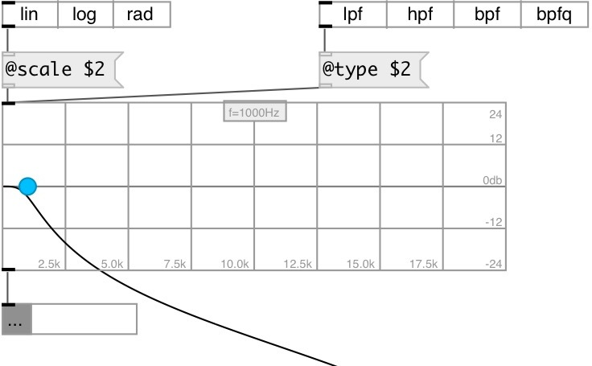

[index](index.html) :: [ui](category_ui.html)
---

# ui.filter

###### UI filter object calculator for biquad filter

*доступно с версии:* 0.9.2

---

## методы:

* **biquad**
set biquad coefficients (but not changes current filter properties) 
  __параметры:__
  - **b0 b1 b2 a1 a2** coefficients 
    тип: list  
    обязательно: True  

* **dump**
dumps all object info to Pd console window 

* **load**
loads specified preset 
  __параметры:__
  - **IDX** preset index 
    тип: int  
    обязательно: True  

* **store**
stores specified preset 
  __параметры:__
  - **IDX** preset index 
    тип: int  
    обязательно: True  

* **clear**
clears specified preset 
  __параметры:__
  - **IDX** preset index 
    тип: int  
    обязательно: True  

* **interp**
for this object acts as *load*, no interpolation performed 

* **pos**
set UI element position 
  __параметры:__
  - **X** top left x-coord 
    тип: float  
    обязательно: True  

  - **Y** top right y-coord 
    тип: float  
    обязательно: True  

## свойства:

* **@freq** 
Получить/установить filter frequency 
_тип:_ float 
_диапазон:_ 0..20000 
_по умолчанию:_ 1000 

* **@scale** 
Получить/установить frequency scale 
_тип:_ symbol 
_варианты:_ lin, log, rad 
_по умолчанию:_ lin 

* **@type** 
Получить/установить frequency scale 
_тип:_ symbol 
_варианты:_ lpf, hpf, bpf, bpfq, lowshelf, highshelf, peak, notch 
_по умолчанию:_ lpf 

* **@gain** 
Получить/установить gain (for low/highshelf/peak filters) 
_тип:_ float 
_единица:_ db 
_диапазон:_ -24..24 
_по умолчанию:_ 0 

* **@q** 
Получить/установить quality factor 
_тип:_ float 
_диапазон:_ 0.015625..64 
_по умолчанию:_ 0.707107 

* **@presetname** 
Получить/установить preset name for using with [ui.preset] 
_тип:_ symbol 
_по умолчанию:_ (null) 

* **@send** 
Получить/установить send destination 
_тип:_ symbol 
_по умолчанию:_ (null) 

* **@receive** 
Получить/установить receive source 
_тип:_ symbol 
_по умолчанию:_ (null) 

* **@size** 
Получить/установить element size (width, height pair) 
_тип:_ list 
_по умолчанию:_ 300 100 

* **@pinned** 
Получить/установить pin mode. if 1 - put element to the lowest level 
_тип:_ int 
_варианты:_ 0, 1 
_по умолчанию:_ 0 

* **@mouse_events** 
Получить/установить mouse events output mode. If on outputs @mouse_down, @mouse_up and @mouse_drag
events 
_тип:_ int 
_варианты:_ 0, 1 
_по умолчанию:_ 0 

* **@background_color** 
Получить/установить element background color (list of red, green, blue values in 0-1 range) 
_тип:_ list 
_по умолчанию:_ 0.93 0.93 0.93 1 

* **@border_color** 
Получить/установить border color (list of red, green, blue values in 0-1 range) 
_тип:_ list 
_по умолчанию:_ 0.6 0.6 0.6 1 

* **@knob_color** 
Получить/установить knob color 
_тип:_ list 
_по умолчанию:_ 0 0.75 1 1 

* **@grid_color** 
Получить/установить knob color 
_тип:_ list 
_по умолчанию:_ 0.6 0.6 0.6 1 

* **@plot_color** 
Получить/установить knob color 
_тип:_ list 
_по умолчанию:_ 0 0 0 1 

* **@fontsize** 
Получить/установить fontsize 
_тип:_ int 
_диапазон:_ 4..11 
_по умолчанию:_ 11 

* **@fontname** 
Получить/установить fontname 
_тип:_ symbol 
_по умолчанию:_ Helvetica 

* **@fontweight** 
Получить/установить font weight 
_тип:_ symbol 
_варианты:_ normal, bold 
_по умолчанию:_ normal 

* **@fontslant** 
Получить/установить font slant 
_тип:_ symbol 
_варианты:_ roman, italic 
_по умолчанию:_ roman 

* **@label** 
Получить/установить label text 
_тип:_ symbol 
_по умолчанию:_ (null) 

* **@label_color** 
Получить/установить label color in RGB format within 0-1 range, for example: 0.2 0.4 0.1 
_тип:_ list 
_по умолчанию:_ 0.6 0.6 0.6 1 

* **@label_inner** 
Получить/установить label position (1 - inner, 0 - outer). 
_тип:_ int 
_варианты:_ 0, 1 
_по умолчанию:_ 0 

* **@label_align** 
Получить/установить label horizontal align 
_тип:_ symbol 
_варианты:_ left, center, right 
_по умолчанию:_ left 

* **@label_valign** 
Получить/установить label vertical align 
_тип:_ symbol 
_варианты:_ top, center, bottom 
_по умолчанию:_ top 

* **@label_side** 
Получить/установить label snap side 
_тип:_ symbol 
_варианты:_ left, top, right, bottom 
_по умолчанию:_ top 

* **@label_margins** 
Получить/установить label offset in pixels 
_тип:_ list 
_по умолчанию:_ 0 0 

## входы:

* control input 
_тип:_ control

## выходы:

* list: b0 b1 b2 a1 a2 
_тип:_ control

## ключевые слова:

[ui](keywords/ui.html)
[filter](keywords/filter.html)
[biquad](keywords/biquad.html)

**Смотрите также:**
[\[ui.filter~\]](ui.filter~.html)

**Авторы:** Serge Poltavsky

**Лицензия:** GPL3 or later

