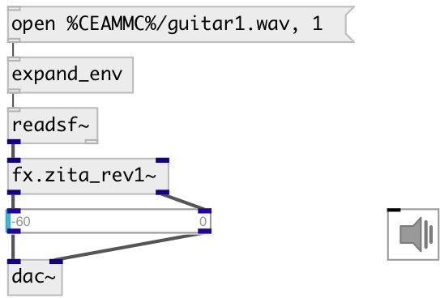

[index](index.html) :: [ui](category_ui.html)
---

# ui.gain2~

###### UI stereo gain control

*доступно с версии:* 0.7

---

## методы:

* **+ N**
increase current gain by N db 

* **- N**
decrease current gain by N db 

* **++**
decrease current gain by 1 db 

* **--**
decrease current gain by 1 db 

* **set N**
set current gain to N db 

* **load**
loads specified preset 
  __параметры:__
  - **IDX** preset index 
    тип: int  
    обязательно: True  

* **store**
stores specified preset 
  __параметры:__
  - **IDX** preset index 
    тип: int  
    обязательно: True  

* **clear**
clears specified preset 
  __параметры:__
  - **IDX** preset index 
    тип: int  
    обязательно: True  

* **interp**
interplolates between presets 
  __параметры:__
  - **IDX** preset fraction index 
    тип: float  
    обязательно: True  

* **pos**
set UI element position 
  __параметры:__
  - **X** top left x-coord 
    тип: float  
    обязательно: True  

  - **Y** top right y-coord 
    тип: float  
    обязательно: True  

## свойства:

* **@max** 
Запросить/установить maximum gain value 
_тип:_ int 
_единица:_ db 
_диапазон:_ -12..12 
_по умолчанию:_ 0 

* **@min** 
Запросить/установить minimal gain value 
_тип:_ int 
_единица:_ db 
_диапазон:_ -90..-15 
_по умолчанию:_ -60 

* **@db** 
Запросить/установить gain in dbfs scale 
_тип:_ float 
_единица:_ db 
_по умолчанию:_ -60 

* **@amp** 
Запросить/установить gain as amplitude ratio 
_тип:_ float 
_по умолчанию:_ 0 

* **@output_value** 
Запросить/установить flag to output @db property after each knob move 
_тип:_ bool 
_по умолчанию:_ 0 

* **@relative** 
Запросить/установить relative input mode. When set do not jump to value on click. 
_тип:_ bool 
_по умолчанию:_ 1 

* **@show_range** 
Запросить/установить if show slider range 
_тип:_ bool 
_по умолчанию:_ 1 

* **@presetname** 
Запросить/установить preset name for using with [ui.preset] 
_тип:_ symbol 
_по умолчанию:_ (null) 

* **@mouse_events** 
Запросить/установить mouse events output mode. If on outputs @mouse_down, @mouse_up and @mouse_drag
events 
_тип:_ bool 
_по умолчанию:_ 0 

* **@send** 
Запросить/установить send destination 
_тип:_ symbol 
_по умолчанию:_ (null) 

* **@receive** 
Запросить/установить receive source 
_тип:_ symbol 
_по умолчанию:_ (null) 

* **@size** 
Запросить/установить element size (width, height pair) 
_тип:_ list 
_по умолчанию:_ 15 120 

* **@pinned** 
Запросить/установить pin mode. if 1 - put element to the lowest level 
_тип:_ bool 
_по умолчанию:_ 0 

* **@knob_color** 
Запросить/установить knob color (list of red, green, blue values in 0-1 range) 
_тип:_ list 
_по умолчанию:_ 0 0.75 1 1 

* **@background_color** 
Запросить/установить element background color (list of red, green, blue values in 0-1 range) 
_тип:_ list 
_по умолчанию:_ 0.93 0.93 0.93 1 

* **@border_color** 
Запросить/установить border color (list of red, green, blue values in 0-1 range) 
_тип:_ list 
_по умолчанию:_ 0.6 0.6 0.6 1 

* **@fontsize** 
Запросить/установить fontsize 
_тип:_ int 
_диапазон:_ 4..100 
_по умолчанию:_ 11 

* **@fontname** 
Запросить/установить fontname 
_тип:_ symbol 
_варианты:_ Courier, DejaVu, Helvetica, Monaco, Times 
_по умолчанию:_ Helvetica 

* **@fontweight** 
Запросить/установить font weight 
_тип:_ symbol 
_варианты:_ normal, bold 
_по умолчанию:_ normal 

* **@fontslant** 
Запросить/установить font slant 
_тип:_ symbol 
_варианты:_ roman, italic 
_по умолчанию:_ roman 

* **@midi_channel** 
Запросить/установить binded MIDI channel. 0 means listen to all channels 
_тип:_ int 
_диапазон:_ 0..16 
_по умолчанию:_ 0 

* **@midi_control** 
Запросить/установить binded MIDI controller number. -1 means not binded to any controller. 
_тип:_ int 
_диапазон:_ -1..127 
_по умолчанию:_ -1 

* **@midi_pickup** 
Запросить/установить pickup current value. If slider is binded to value, first time you should pass
over this value to make binding. It prevents from sudden value change on first
control change 
_тип:_ bool 
_по умолчанию:_ 1 

## входы:

* left input signal 
_тип:_ audio
* right input signal 
_тип:_ audio

## выходы:

* left output signal 
_тип:_ audio
* right output signal 
_тип:_ audio

## ключевые слова:

[ui](keywords/ui.html)
[gain](keywords/gain.html)

**Авторы:** Serge Potlavsky

**Лицензия:** GPL3 or later

