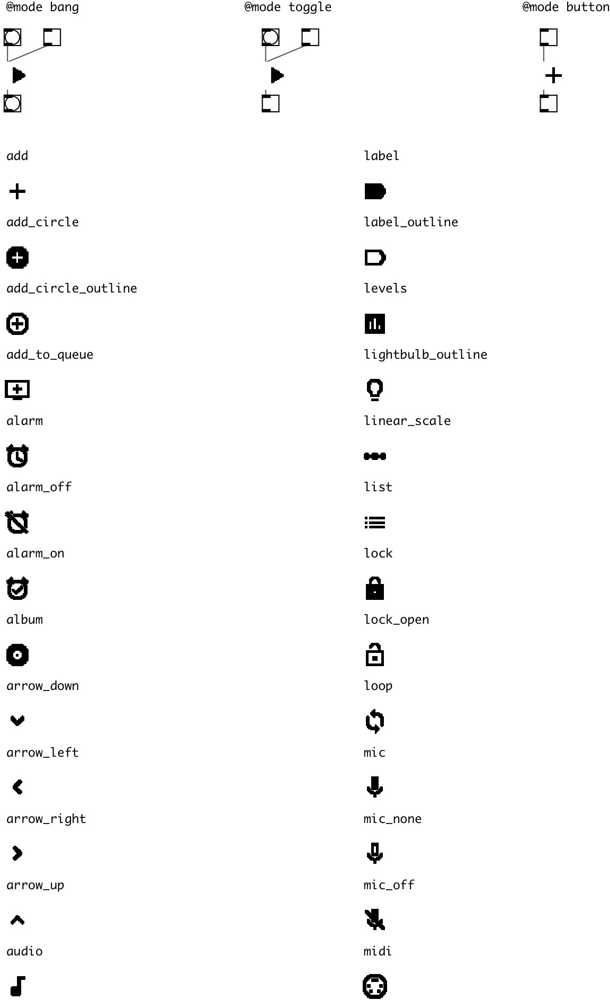

[index](index.html) :: [ui](category_ui.html)
---

# ui.icon

###### simple icon with button capabilities

*доступно с версии:* 0.5

---

## информация
Alt+Click outputs all possible icon names to Pd window. Can be in bang, button and toggle modes. Button mode is default: outputs 1 on mouse down, 0 on mouse up. See @mode property for more information.

## аргументы:

* **NAME**
icon name from list 
_тип:_ symbol 

## методы:

* **clear**
clears specified preset 
  __параметры:__
  - **IDX** preset index 
    тип: int  
    обязательно: True  

* **interp**
for this object acts as *load*, no interpolation performed 

* **load**
loads specified preset 
  __параметры:__
  - **IDX** preset index 
    тип: int  
    обязательно: True  

* **pos**
set UI element position 
  __параметры:__
  - **X** top left x-coord 
    тип: float  
    обязательно: True  

  - **Y** top right y-coord 
    тип: float  
    обязательно: True  

* **set**
sets icon name 

* **store**
stores specified preset 
  __параметры:__
  - **IDX** preset index 
    тип: int  
    обязательно: True  

## свойства:

* **@mode** 
Запросить/установить output mode. In bang mode - outputs bang on mouse down. In button mode outputs
1 on mouse down and 0 on mouse up. In toggle mode outputs 1/0 on mouse down,
like vanilla toggle object. 
_тип:_ symbol 
_варианты:_ toggle, button, bang 
_по умолчанию:_ button 

* **@enabled** 
Запросить/установить enabled property 
_тип:_ bool 
_по умолчанию:_ 1 

* **@icon_size** 
Запросить/установить icons size 
_тип:_ int 
_варианты:_ 18, 24, 36, 48 
_по умолчанию:_ 24 

* **@icon** 
Запросить/установить icon name 
_тип:_ symbol 
_варианты:_ add, add_circle, add_circle_outline, add_to_queue, alarm, alarm_off, alarm_on, album, arrow_down, arrow_left, arrow_right, arrow_up, audio, backspace, block, bluetooth, blur_on, bookmark, bookmark_border, build, cached, capslock, check_circle, ceammc, clear, clock, computer, content_cut, copy, copyright, delete, delete_forever, done, eject, equalizer, exit, fast_forward, fast_rewind, favorite, favorite_border, fingerprint, flag, folder, folder_open, functions, gamepad, get_app, grade, grain, group, hdmi, headset, headset_mic, hearing, help, help_outline, history, home, hourglass, info, info_outline, input, keyboard, label, label_outline, levels, lightbulb_outline, linear_scale, list, lock, lock_open, loop, mic, mic_none, mic_off, midi, mouse, movie, notifications, open_with, pause, pause_circle_filled, pause_circle_outline, play, play_circle_filled, play_circle_filled_white, play_circle_outline, power, radio, record, redo, refresh, remove, remove_circle, remove_circle_outline, repeat, repeat_one, report_problem, save, search, select_all, settings, settings2, settings_voice, shuffle, skip_next, skip_previous, speaker, speaker_group, stars, stop, tape, timeline, touch_app, trending_flat, undo, videocam, visibility, visibility_off, volume_down, volume_mute, volume_off, volume_up, zoom_in, zoom_out 
_по умолчанию:_ help 

* **@presetname** 
Запросить/установить preset name for using with [ui.preset] 
_тип:_ symbol 
_по умолчанию:_ (null) 

* **@send** 
Запросить/установить send destination 
_тип:_ symbol 
_по умолчанию:_ (null) 

* **@receive** 
Запросить/установить receive source 
_тип:_ symbol 
_по умолчанию:_ (null) 

* **@pinned** 
Запросить/установить pin mode. if 1 - put element to the lowest level 
_тип:_ bool 
_по умолчанию:_ 0 

* **@active_color** 
Запросить/установить active color (list of red, green, blue values in 0-1 range) 
_тип:_ list 
_по умолчанию:_ 0 0.75 1 1 

* **@background_color** 
Запросить/установить element background color (list of red, green, blue values in 0-1 range) 
_тип:_ list 
_по умолчанию:_ 1 1 1 1 

* **@border_color** 
Запросить/установить border color (list of red, green, blue values in 0-1 range) 
_тип:_ list 
_по умолчанию:_ 1 1 1 1 

* **@fontsize** 
Запросить/установить fontsize 
_тип:_ int 
_диапазон:_ 4..100 
_по умолчанию:_ 11 

* **@fontname** 
Запросить/установить fontname 
_тип:_ symbol 
_варианты:_ Helvetica, Monaco, Courier, Times, DejaVu 
_по умолчанию:_ Helvetica 

* **@fontweight** 
Запросить/установить font weight 
_тип:_ symbol 
_варианты:_ normal, bold 
_по умолчанию:_ normal 

* **@fontslant** 
Запросить/установить font slant 
_тип:_ symbol 
_варианты:_ roman, italic 
_по умолчанию:_ roman 

## входы:

* (hidden inlet!) see @mode property 
_тип:_ control

## выходы:

* (hidden outlet!) see @mode property 
_тип:_ control

## ключевые слова:

[ui](keywords/ui.html)
[icon](keywords/icon.html)
[button](keywords/button.html)

**Смотрите также:**
[\[ui.bang\]](ui.bang.html)

**Авторы:** Serge Poltavsky

**Лицензия:** GPL3 or later

