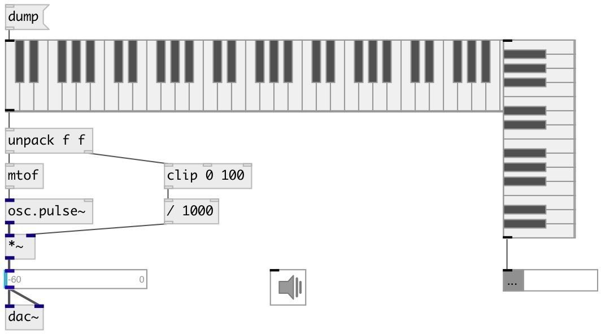

[index](index.html) :: [ui](category_ui.html)
---

# ui.keyboard

###### keyboard widget

*доступно с версии:* 0.1

---

## информация
Piano keyboard widget [ui.vkeyboard] and [ui.vk] - aliases for vertical keyboard

## аргументы:

* **NKEYS**
number of keys 
_тип:_ int 

* **SHIFT**
pitch of starting key 
_тип:_ int 

## методы:

* **dump**
dumps all object info to Pd console window 

* **pos**
set UI element position 
  __параметры:__
  - **X** top left x-coord 
    тип: float  
    обязательно: True  

  - **Y** top right y-coord 
    тип: float  
    обязательно: True  

## свойства:

* **@keys** 
Получить/установить number of keys 
_тип:_ int 
_диапазон:_ 5..88 
_по умолчанию:_ 61 

* **@shift** 
Получить/установить MIDI pitch of starting key 
_тип:_ int 
_диапазон:_ 6..88 
_по умолчанию:_ 36 

* **@send** 
Получить/установить send destination 
_тип:_ symbol 
_по умолчанию:_ (null) 

* **@receive** 
Получить/установить receive source 
_тип:_ symbol 
_по умолчанию:_ (null) 

* **@size** 
Получить/установить element size (width, height pair) 
_тип:_ list 
_по умолчанию:_ 433 60 

* **@pinned** 
Получить/установить pin mode. if 1 - put element to the lowest level 
_тип:_ int 
_варианты:_ 0, 1 
_по умолчанию:_ 0 

* **@active_color** 
Получить/установить active color (list of red, green, blue values in 0-1 range) 
_тип:_ list 
_по умолчанию:_ 0 0.75 1 1 

* **@background_color** 
Получить/установить element background color (list of red, green, blue values in 0-1 range) 
_тип:_ list 
_по умолчанию:_ 0.93 0.93 0.93 1 

* **@border_color** 
Получить/установить border color (list of red, green, blue values in 0-1 range) 
_тип:_ list 
_по умолчанию:_ 0.6 0.6 0.6 1 

* **@fontsize** 
Получить/установить fontsize 
_тип:_ int 
_диапазон:_ 4..11 
_по умолчанию:_ 11 

* **@fontname** 
Получить/установить fontname 
_тип:_ symbol 
_по умолчанию:_ Helvetica 

* **@fontweight** 
Получить/установить font weight 
_тип:_ symbol 
_варианты:_ normal, bold 
_по умолчанию:_ normal 

* **@fontslant** 
Получить/установить font slant 
_тип:_ symbol 
_варианты:_ roman, italic 
_по умолчанию:_ roman 

## входы:

* control inlet 
_тип:_ control

## выходы:

* list from two elements: MIDI pitch, MIDI velocity. Velocity depends from key press position. 
_тип:_ control

## ключевые слова:

[ui](keywords/ui.html)
[keyboard](keywords/keyboard.html)

**Смотрите также:**
[\[ui.preset\]](ui.preset.html)

**Авторы:** Alex Nadzharov, Serge Poltavsky

**Лицензия:** GPL3 or later

